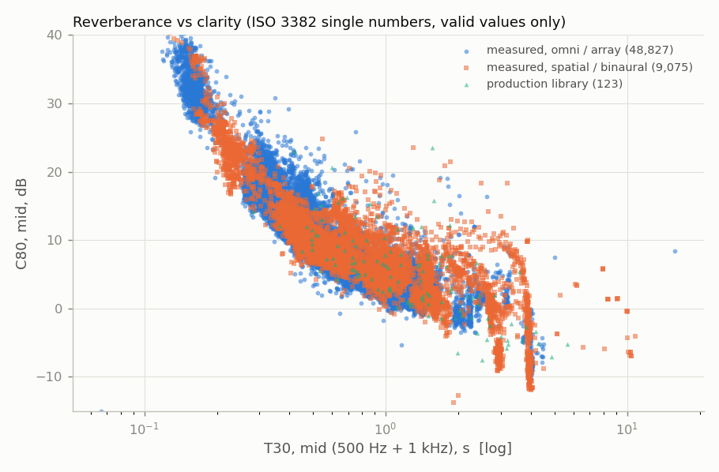
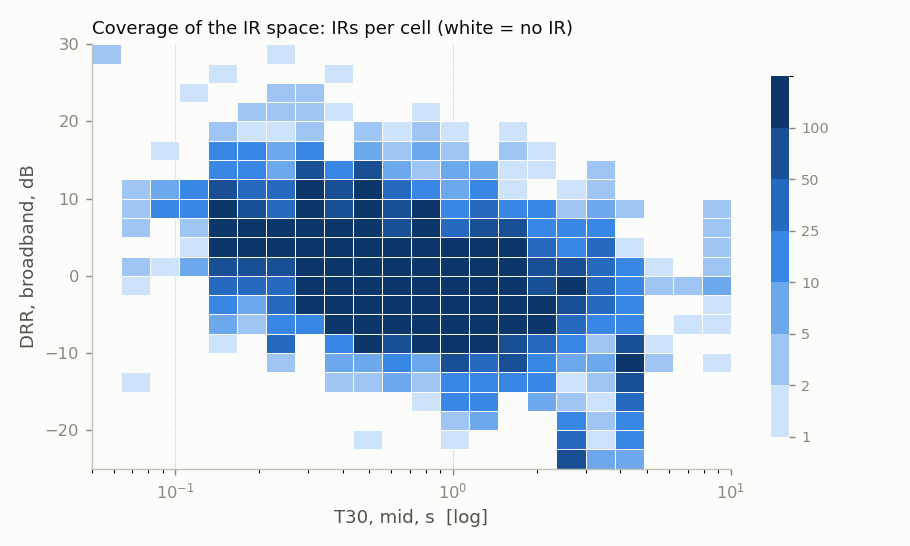
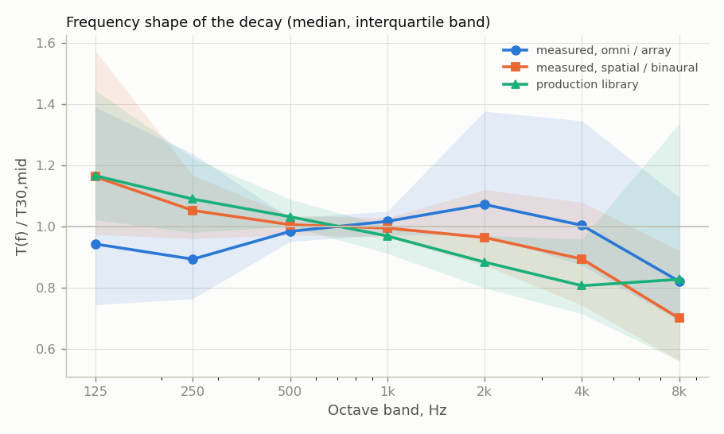

# Corpus report

Generated 2026-09-30 23:59 UTC by `rirdb report corpus` from `metrics/v1` (analyzer 1.0.0, config b6f0e3615d1b769b).

**253,422 IRs** analysed from **43 datasets**, **646 rooms/spaces**; 199,658 are room IRs (the rest: outdoor, scale models, anechoic, devices). Grades: A 51,242, B 74,990, C 69,383, D 57,807 (A: T30 valid 125 Hz-4 kHz; B: T20/T30 valid 250 Hz-2 kHz; C: partial; D: none).

Single numbers follow ISO 3382-1 (mean of 500 Hz and 1 kHz; only where both are valid). Figures use one preferred representation per measured position (e.g. OpenAIR B-format over its mono copy) and room IRs only.

## Per dataset (medians unless noted)

| dataset | IRs | rooms | A/B/C/D | T30 mid (p10-p50-p90) | EDT mid | C80 mid | D50 mid | DRR | STI | BR / TR | t_mix ms | errors |
|---|---|---|---|---|---|---|---|---|---|---|---|---|
| aachen_air | 107 | 12 | 99/8/0/0 | 0.33 / 1.03 / 2.62 | 0.51 | 10.0 | 0.79 | 6.2 | 0.81 | 1.00 / 0.88 | 40 | 0 |
| aalto_multiroom | 1336 | 3 | 302/640/393/1 | 0.37 / 0.69 / 1.10 | 0.75 | 5.0 | 0.57 | -6.1 | 0.68 | 1.47 / 0.93 | 26 | 0 |
| ace | 14 | 7 | 14/0/0/0 | 0.40 / 0.48 / 1.40 | 0.41 | 12.0 | 0.84 | 4.4 | 0.81 | 1.30 / 1.01 | 39 | 0 |
| ace_arrays | 70 | 7 | 65/4/1/0 | 0.40 / 0.48 / 1.68 | 0.40 | 11.7 | 0.85 | 4.3 | 0.82 | 1.31 / 0.98 | 38 | 0 |
| arni | 26221 | 1 | 26103/86/32/0 | 0.33 / 0.51 / 1.03 | 0.48 | 9.5 | 0.76 | -3.0 | 0.73 | 0.79 / 1.33 | 24 | 0 |
| arni_6dof_srir | 210 | 1 | 210/0/0/0 | 0.29 / 0.44 / 0.91 | 0.41 | 10.9 | 0.80 | -1.1 | 0.77 | 0.90 / 1.20 | 24 | 0 |
| bbc_brirs | 32 | 1 | 22/10/0/0 | 0.17 / 0.17 / 0.18 | 0.15 | 27.9 | 0.98 | 5.0 | 0.92 | 1.58 / 1.10 | 37 | 0 |
| bras | 226 | 4 | 220/6/0/0 | 1.31 / 1.99 / 2.97 | 1.86 | -0.0 | 0.34 | -6.0 | 0.53 | 1.17 / 0.84 | 38 | 0 |
| brudex | 1512 | 1 | 1508/4/0/0 | 0.27 / 0.56 / 1.43 | 0.55 | 8.2 | 0.72 | -0.5 | 0.76 | 0.96 / 0.84 | 28 | 0 |
| but_reverb | 1674 | 9 | 834/517/323/0 | 0.46 / 0.71 / 1.13 | 0.92 | 4.4 | 0.54 | -5.9 |  | 1.05 / 0.93 | 20 | 0 |
| c4dm | 468 | 3 | 0/468/0/0 | 1.95 / 2.42 / 3.14 | 2.36 | 0.2 | 0.40 | -0.8 | 0.53 |  / 0.86 | 26 | 0 |
| churchir | 180 | 1 | 164/16/0/0 | 3.96 / 4.00 / 4.05 | 4.04 | -7.8 | 0.10 | -11.1 | 0.35 | 1.19 / 0.76 | 33 | 0 |
| dechorate | 2100 | 1 | 1040/1047/13/0 | 0.15 / 0.18 / 0.46 | 0.18 | 24.4 | 0.97 | 3.3 | 0.92 | 1.14 / 0.75 | 23 | 0 |
| detmold_srir | 657 | 3 | 224/416/17/0 | 1.57 / 1.61 / 1.64 | 1.50 | 1.2 | 0.43 | -2.9 | 0.58 | 1.10 / 0.86 | 39 | 0 |
| echothief | 115 | 115 | 93/22/0/0 | 0.43 / 1.09 / 2.40 | 0.73 | 7.5 | 0.73 | -1.1 | 0.75 | 1.18 / 0.87 | 34 | 0 |
| em32_line_arni | 585 | 1 | 495/90/0/0 | 0.23 / 0.44 / 0.99 | 0.38 | 12.5 | 0.85 | 0.7 | 0.82 | 0.97 / 0.93 | 14 | 0 |
| flair | 270 | 1 | 0/270/0/0 | 0.27 / 0.28 / 0.30 | 0.25 | 17.5 | 0.92 | 1.7 | 0.85 | 1.61 / 1.04 | 46 | 0 |
| ho_rir_cremona | 325 | 1 | 325/0/0/0 | 1.46 / 1.49 / 1.53 | 1.28 | 5.3 | 0.68 | 2.6 | 0.72 | 1.03 / 0.97 | 40 | 0 |
| homula_rir | 52 | 1 | 46/6/0/0 | 0.65 / 0.68 / 0.71 | 0.58 | 7.9 | 0.72 | -1.1 | 0.71 | 1.03 / 1.34 | 20 | 0 |
| huddersfield_360_brir | 17 | 1 | 16/1/0/0 | 2.30 / 2.32 / 2.35 | 2.43 | 0.6 | 0.46 | -0.1 | 0.59 | 1.12 / 0.73 | 43 | 0 |
| iosr_listening_room_brirs | 24 | 1 | 23/0/1/0 | 0.21 / 0.22 / 0.23 | 0.20 | 22.7 | 0.96 | 5.9 | 0.91 | 1.48 / 0.91 | 33 | 0 |
| mckenzie_rtd | 1616 | 4 | 1273/343/0/0 | 0.20 / 0.44 / 1.51 | 0.36 | 12.4 | 0.85 | 1.5 | 0.81 | 1.49 / 1.05 | 28 | 0 |
| meshgrid3d | 16133 | 1 | 0/0/12267/3866 |  /  /  |  |  |  | 6.4 | 0.81 |  /  | 50 | 0 |
| meshrir | 1193 | 1 | 0/1178/15/0 | 0.30 / 0.33 / 0.40 | 0.20 | 19.2 | 0.95 | 8.1 | 0.92 | 1.61 / 0.73 | 39 | 0 |
| metu_sparg | 244 | 1 | 244/0/0/0 | 1.25 / 1.28 / 1.31 | 1.22 | 3.3 | 0.55 | 2.6 | 0.68 | 0.87 / 0.68 | 46 | 0 |
| miracle | 53446 | 1 | 0/0/0/53446 |  /  /  |  |  |  |  |  |  /  |  | 0 |
| mit_survey | 270 | 270 | 180/84/6/0 | 0.07 / 0.38 / 1.01 | 0.11 | 20.1 | 0.97 | 11.7 | 0.96 | 1.10 / 0.83 | 24 | 0 |
| motus | 3320 | 1 | 1302/2018/0/0 | 0.46 / 0.55 / 0.92 | 0.51 | 8.7 | 0.73 | 0.5 | 0.77 | 1.06 / 1.00 | 33 | 0 |
| mp_rir | 4331 | 1 | 4322/6/3/0 | 0.52 / 0.55 / 0.58 | 0.52 | 8.7 | 0.73 | -1.4 | 0.74 | 1.56 / 1.02 | 22 | 0 |
| myriad | 1214 | 2 | 1213/1/0/0 | 0.49 / 0.51 / 0.55 | 0.45 | 10.4 | 0.80 | -0.4 | 0.78 | 1.28 / 0.99 | 35 | 0 |
| ok5 | 70 | 25 | 69/0/1/0 | 0.35 / 0.49 / 1.53 | 0.41 | 11.3 | 0.83 | 4.3 | 0.81 | 1.61 / 1.01 | 32 | 0 |
| openair | 690 | 58 | 595/39/56/0 | 0.58 / 1.57 / 7.95 | 1.33 | 3.2 | 0.56 | -0.9 | 0.63 | 1.08 / 0.81 | 33 | 0 |
| openslr28 | 199 | 19 | 73/78/48/0 | 0.06 / 0.44 / 0.75 | 0.36 | 11.4 | 0.81 | 4.6 |  | 1.22 / 0.81 | 30 | 0 |
| raves | 190 | 7 | 159/28/3/0 | 0.23 / 0.49 / 1.20 | 0.40 | 11.7 | 0.84 | 3.1 | 0.82 | 1.16 / 0.90 | 28 | 0 |
| rochester | 90 | 14 | 82/7/1/0 | 0.17 / 0.45 / 1.88 | 0.41 | 10.4 | 0.83 | -2.4 | 0.81 | 1.47 / 0.98 | 14 | 0 |
| rsoanu | 786 | 1 | 77/581/128/0 | 0.76 / 0.84 / 0.91 | 0.76 | 5.7 | 0.64 | -3.3 | 0.67 | 0.86 / 1.08 | 30 | 0 |
| sriracha | 82587 | 1 | 3/65763/16821/0 | 0.75 / 0.77 / 0.80 | 1.26 | 4.5 | 0.62 | 1.0 | 0.69 | 0.92 / 0.89 | 40 | 0 |
| surrey_real_room_brirs | 185 | 5 | 127/21/0/37 | 0.28 / 0.54 / 0.96 | 0.31 | 14.5 | 0.91 | 6.0 | 0.86 | 1.51 / 1.02 | 52 | 0 |
| tau_srir | 38530 | 9 | 0/18/38059/453 |  /  /  | 0.46 | 10.9 | 0.82 | 4.9 | 0.82 |  / 1.04 | 24 | 0 |
| trajectorir | 8648 | 1 | 8646/2/0/0 | 0.45 / 0.48 / 0.50 | 0.42 | 11.7 | 0.84 | 2.4 | 0.81 | 1.34 / 0.93 | 35 | 0 |
| tuil_robot_coupled | 2119 | 8 | 1042/1044/33/0 | 1.01 / 2.63 / 3.91 | 0.87 | 3.6 | 0.48 | -4.9 | 0.63 | 1.10 / 0.75 | 23 | 0 |
| upv_rir_db | 1328 | 3 | 0/168/1160/0 | 0.39 / 0.41 / 0.44 | 0.66 | 8.6 | 0.77 | 5.0 | 0.78 | 1.12 / 1.23 | 50 | 0 |
| voxengo | 38 | 38 | 32/0/2/4 | 0.59 / 1.05 / 4.07 | 1.03 | 2.6 | 0.44 | -5.7 | 0.62 | 1.03 / 0.86 | 54 | 0 |

## Quality-flag rates (% of IRs; flags seen in >= 1 % of some dataset)

| dataset | clipped | dc offset | short | low fs | pre onset energy | tail truncated | lundeby failed any | no noise floor | low pnr | implausible hf decay | curved decay | nonlinear decay | filter bias risk | edc method disagreement | mic not omni | omni proxy | orientation unknown |
|---|---|---|---|---|---|---|---|---|---|---|---|---|---|---|---|---|---|
| aachen_air | 0 | 0 | 4 | 0 | 0 | 19 | 3 | 12 | 0 | 0 | 80 | 27 | 1 | 0 | 63 | 0 | <NA> |
| aalto_multiroom | 0 | 2 | 0 | 0 | 5 | 1 | 7 | 5 | 4 | 0 | 31 | 19 | 0 | 0 | 50 | 50 | <NA> |
| ace | 0 | 0 | 0 | 0 | 0 | 21 | 0 | 43 | 0 | 0 | 57 | 36 | 0 | 0 | 0 | 0 | <NA> |
| ace_arrays | 0 | 0 | 0 | 0 | 0 | 37 | 0 | 50 | 0 | 0 | 67 | 46 | 0 | 1 | 0 | 20 | <NA> |
| arni | 0 | 0 | 0 | 0 | 0 | 0 | 1 | 0 | 0 | 0 | 2 | 0 | 1 | 0 | 0 | 0 | <NA> |
| arni_6dof_srir | 0 | 0 | 0 | 0 | 5 | 0 | 1 | 0 | 0 | 0 | 17 | 11 | 0 | 0 | 0 | 0 | <NA> |
| bbc_brirs | 0 | 0 | 0 | 0 | 0 | 0 | 0 | 0 | 0 | 0 | 38 | 0 | 9 | 0 | 100 | 0 | <NA> |
| bras | 0 | 0 | 0 | 0 | 3 | 0 | 0 | 2 | 0 | 0 | 10 | 10 | 0 | 0 | 8 | 0 | <NA> |
| brudex | 0 | 0 | 0 | 0 | 0 | 0 | 1 | 0 | 0 | 0 | 26 | 24 | 0 | 0 | 0 | 0 | <NA> |
| but_reverb | 0 | 0 | 0 | 100 | 0 | 1 | 1 | 42 | 8 | 0 | 14 | 12 | 1 | 2 | 0 | 0 | <NA> |
| c4dm | 0 | 0 | 0 | 0 | 0 | 0 | 46 | 16 | 0 | 0 | 0 | 11 | 0 | 0 | 0 | 0 | <NA> |
| churchir | 0 | 0 | 0 | 0 | 0 | 0 | 3 | 0 | 0 | 0 | 0 | 0 | 0 | 0 | 0 | 50 | <NA> |
| dechorate | 0 | 0 | 0 | 0 | 10 | 3 | 2 | 16 | 0 | 0 | 51 | 52 | 2 | 0 | 0 | 0 | <NA> |
| detmold_srir | 0 | 0 | 0 | 0 | 0 | 0 | 4 | 57 | 0 | 0 | 2 | 1 | 0 | 3 | 44 | 0 | <NA> |
| echothief | 0 | 0 | 3 | 0 | 0 | 25 | 4 | 75 | 0 | 10 | 53 | 47 | 2 | 1 | 0 | 0 | <NA> |
| em32_line_arni | 0 | 0 | 0 | 0 | 0 | 6 | 0 | 35 | 0 | 0 | 33 | 32 | 0 | 0 | 0 | 100 | <NA> |
| flair | 0 | 0 | 0 | 0 | 0 | 5 | 6 | 10 | 0 | 0 | 36 | 24 | 0 | 1 | 0 | 0 | <NA> |
| ho_rir_cremona | 0 | 0 | 0 | 0 | 0 | 1 | 0 | 44 | 0 | 0 | 0 | 0 | 0 | 0 | 0 | 100 | <NA> |
| homula_rir | 0 | 0 | 0 | 0 | 0 | 0 | 4 | 29 | 0 | 0 | 4 | 2 | 0 | 0 | 0 | 96 | <NA> |
| huddersfield_360_brir | 0 | 0 | 0 | 0 | 0 | 0 | 0 | 0 | 0 | 0 | 0 | 0 | 0 | 0 | 100 | 0 | <NA> |
| iosr_listening_room_brirs | 0 | 0 | 0 | 0 | 0 | 0 | 4 | 0 | 0 | 0 | 71 | 38 | 0 | 0 | 100 | 0 | <NA> |
| mckenzie_rtd | 0 | 0 | 0 | 0 | 0 | 0 | 1 | 18 | 0 | 9 | 62 | 53 | 0 | 8 | 0 | 0 | <NA> |
| meshgrid3d | 0 | 0 | 100 | 0 | 0 | 0 | 96 | 100 | 5 | 0 | 0 | 0 | 0 | 0 | 0 | 0 | <NA> |
| meshrir | 0 | 0 | 0 | 0 | 0 | 0 | 62 | 0 | 0 | 0 | 43 | 72 | 0 | 0 | 0 | 0 | <NA> |
| metu_sparg | 0 | 0 | 0 | 0 | 0 | 0 | 0 | 0 | 0 | 0 | 3 | 0 | 0 | 0 | 0 | 0 | <NA> |
| miracle | 0 | 0 | 100 | 0 | 0 | <NA> | <NA> | <NA> | <NA> | <NA> | <NA> | <NA> | <NA> | <NA> | <NA> | <NA> | <NA> |
| mit_survey | 0 | 0 | 28 | 0 | 0 | 24 | 3 | 9 | 0 | 0 | 63 | 59 | 1 | 1 | 0 | 0 | <NA> |
| motus | 0 | 0 | 0 | 0 | 0 | 0 | 3 | 0 | 0 | 0 | 28 | 7 | 6 | 4 | 0 | 0 | <NA> |
| mp_rir | 0 | 0 | 0 | 0 | 1 | 0 | 0 | 0 | 0 | 0 | 71 | 43 | 0 | 0 | 0 | 0 | <NA> |
| myriad | 0 | 0 | 0 | 0 | 0 | 0 | 0 | 0 | 0 | 0 | 5 | 0 | 0 | 0 | 0 | 0 | <NA> |
| ok5 | 0 | 0 | 0 | 0 | 0 | 0 | 1 | 0 | 0 | 0 | 66 | 53 | 0 | 0 | 0 | 0 | <NA> |
| openair | 1 | 0 | 0 | 0 | 5 | 2 | 9 | 10 | 0 | 1 | 40 | 28 | 0 | 1 | 0 | 0 | 51 |
| openslr28 | 1 | 8 | 21 | 100 | 0 | 0 | 28 | 14 | 0 | 0 | 24 | 24 | 4 | 0 | 0 | 0 | <NA> |
| raves | 0 | 0 | 0 | 0 | 1 | 0 | 1 | 4 | 0 | 0 | 36 | 37 | 3 | 0 | 50 | 0 | <NA> |
| rochester | 0 | 0 | 0 | 0 | 6 | 2 | 1 | 13 | 0 | 0 | 34 | 41 | 2 | 0 | 0 | 0 | <NA> |
| rsoanu | 0 | 37 | 0 | 0 | 0 | 0 | 15 | 2 | 0 | 31 | 2 | 1 | 0 | 2 | 0 | 50 | 50 |
| sriracha | 0 | 0 | 0 | 0 | 0 | 0 | 3 | 65 | 0 | 0 | 1 | 0 | 0 | 0 | 0 | 0 | <NA> |
| surrey_real_room_brirs | 0 | 0 | 20 | 0 | 0 | 0 | 0 | 0 | 0 | 0 | 26 | 20 | 3 | 0 | 80 | 0 | <NA> |
| tau_srir | 0 | 0 | 99 | 100 | 0 | 1 | 61 | 61 | 7 | 0 | 0 | 0 | 0 | 0 | 0 | 0 | 100 |
| trajectorir | 0 | 0 | 0 | 0 | 0 | 0 | 0 | 0 | 0 | 0 | 28 | 1 | 0 | 0 | 0 | 0 | <NA> |
| tuil_robot_coupled | 0 | 0 | 0 | 0 | 13 | 0 | 0 | 1 | 0 | 0 | 50 | 47 | 0 | 2 | 0 | 0 | <NA> |
| upv_rir_db | 0 | 0 | 0 | 0 | 0 | 7 | 59 | 48 | 0 | 0 | 0 | 0 | 0 | 0 | 63 | 0 | <NA> |
| voxengo | 5 | 3 | 13 | 0 | 0 | 0 | 8 | 50 | 5 | 3 | 5 | 5 | 0 | 0 | 0 | 0 | <NA> |

## Exact duplicates

840 group(s) of byte-identical IRs (the `corpus_dedup` view marks all but one with `dup_of`):

- tau_srir: TAU-SRIR_DB/rirs_02_gym.mat#foa/2,1,284 = tau_srir: TAU-SRIR_DB/rirs_02_gym.mat#foa/2,1,285
- tau_srir: TAU-SRIR_DB/rirs_04_pc226.mat#foa/1,1,270 = tau_srir: TAU-SRIR_DB/rirs_04_pc226.mat#foa/1,1,271
- tau_srir: TAU-SRIR_DB/rirs_03_pb132.mat#foa/2,0,34 = tau_srir: TAU-SRIR_DB/rirs_03_pb132.mat#foa/2,0,36
- tau_srir: TAU-SRIR_DB/rirs_10_tc352.mat#foa/5,0,179 = tau_srir: TAU-SRIR_DB/rirs_10_tc352.mat#foa/5,0,181
- tau_srir: TAU-SRIR_DB/rirs_04_pc226.mat#foa/0,1,218 = tau_srir: TAU-SRIR_DB/rirs_04_pc226.mat#foa/0,1,219
- tau_srir: TAU-SRIR_DB/rirs_04_pc226.mat#foa/7,1,263 = tau_srir: TAU-SRIR_DB/rirs_04_pc226.mat#foa/7,1,264
- tau_srir: TAU-SRIR_DB/rirs_01_bomb_shelter.mat#foa/3,0,102 = tau_srir: TAU-SRIR_DB/rirs_01_bomb_shelter.mat#foa/3,0,103
- tau_srir: TAU-SRIR_DB/rirs_10_tc352.mat#foa/1,0,317 = tau_srir: TAU-SRIR_DB/rirs_10_tc352.mat#foa/1,0,318
- tau_srir: TAU-SRIR_DB/rirs_01_bomb_shelter.mat#foa/4,1,325 = tau_srir: TAU-SRIR_DB/rirs_01_bomb_shelter.mat#foa/4,1,326
- tau_srir: TAU-SRIR_DB/rirs_02_gym.mat#foa/0,1,139 = tau_srir: TAU-SRIR_DB/rirs_02_gym.mat#foa/0,1,140
- tau_srir: TAU-SRIR_DB/rirs_01_bomb_shelter.mat#foa/0,1,188 = tau_srir: TAU-SRIR_DB/rirs_01_bomb_shelter.mat#foa/0,1,191
- tau_srir: TAU-SRIR_DB/rirs_04_pc226.mat#foa/3,1,116 = tau_srir: TAU-SRIR_DB/rirs_04_pc226.mat#foa/3,1,117
- tau_srir: TAU-SRIR_DB/rirs_01_bomb_shelter.mat#foa/4,0,222 = tau_srir: TAU-SRIR_DB/rirs_01_bomb_shelter.mat#foa/4,0,223
- tau_srir: TAU-SRIR_DB/rirs_03_pb132.mat#foa/4,0,204 = tau_srir: TAU-SRIR_DB/rirs_03_pb132.mat#foa/4,0,206
- tau_srir: TAU-SRIR_DB/rirs_10_tc352.mat#foa/3,1,224 = tau_srir: TAU-SRIR_DB/rirs_10_tc352.mat#foa/3,1,225
- tau_srir: TAU-SRIR_DB/rirs_10_tc352.mat#foa/6,1,109 = tau_srir: TAU-SRIR_DB/rirs_10_tc352.mat#foa/6,1,110
- tau_srir: TAU-SRIR_DB/rirs_04_pc226.mat#foa/8,0,212 = tau_srir: TAU-SRIR_DB/rirs_04_pc226.mat#foa/8,0,213
- tau_srir: TAU-SRIR_DB/rirs_04_pc226.mat#foa/5,0,118 = tau_srir: TAU-SRIR_DB/rirs_04_pc226.mat#foa/5,0,121
- tau_srir: TAU-SRIR_DB/rirs_04_pc226.mat#foa/8,1,108 = tau_srir: TAU-SRIR_DB/rirs_04_pc226.mat#foa/8,1,109
- tau_srir: TAU-SRIR_DB/rirs_04_pc226.mat#foa/3,0,76 = tau_srir: TAU-SRIR_DB/rirs_04_pc226.mat#foa/3,0,79
- tau_srir: TAU-SRIR_DB/rirs_01_bomb_shelter.mat#foa/2,1,123 = tau_srir: TAU-SRIR_DB/rirs_01_bomb_shelter.mat#foa/2,1,124
- tau_srir: TAU-SRIR_DB/rirs_03_pb132.mat#foa/0,0,124 = tau_srir: TAU-SRIR_DB/rirs_03_pb132.mat#foa/0,0,126
- tau_srir: TAU-SRIR_DB/rirs_06_sc203.mat#foa/2,1,5 = tau_srir: TAU-SRIR_DB/rirs_06_sc203.mat#foa/2,1,9
- tau_srir: TAU-SRIR_DB/rirs_04_pc226.mat#foa/1,1,258 = tau_srir: TAU-SRIR_DB/rirs_04_pc226.mat#foa/1,1,259
- tau_srir: TAU-SRIR_DB/rirs_04_pc226.mat#foa/2,1,225 = tau_srir: TAU-SRIR_DB/rirs_04_pc226.mat#foa/2,1,226
- tau_srir: TAU-SRIR_DB/rirs_01_bomb_shelter.mat#foa/8,0,290 = tau_srir: TAU-SRIR_DB/rirs_01_bomb_shelter.mat#foa/8,0,292
- tau_srir: TAU-SRIR_DB/rirs_10_tc352.mat#foa/7,0,301 = tau_srir: TAU-SRIR_DB/rirs_10_tc352.mat#foa/7,0,302
- tau_srir: TAU-SRIR_DB/rirs_04_pc226.mat#foa/2,1,297 = tau_srir: TAU-SRIR_DB/rirs_04_pc226.mat#foa/2,1,300
- tau_srir: TAU-SRIR_DB/rirs_04_pc226.mat#foa/7,0,178 = tau_srir: TAU-SRIR_DB/rirs_04_pc226.mat#foa/7,0,180
- tau_srir: TAU-SRIR_DB/rirs_04_pc226.mat#foa/3,1,346 = tau_srir: TAU-SRIR_DB/rirs_04_pc226.mat#foa/3,1,347
- tau_srir: TAU-SRIR_DB/rirs_10_tc352.mat#foa/0,1,260 = tau_srir: TAU-SRIR_DB/rirs_10_tc352.mat#foa/0,1,264
- tau_srir: TAU-SRIR_DB/rirs_01_bomb_shelter.mat#foa/3,1,329 = tau_srir: TAU-SRIR_DB/rirs_01_bomb_shelter.mat#foa/3,1,330
- tau_srir: TAU-SRIR_DB/rirs_10_tc352.mat#foa/4,1,242 = tau_srir: TAU-SRIR_DB/rirs_10_tc352.mat#foa/4,1,243
- tau_srir: TAU-SRIR_DB/rirs_04_pc226.mat#foa/7,0,286 = tau_srir: TAU-SRIR_DB/rirs_04_pc226.mat#foa/7,0,288
- tau_srir: TAU-SRIR_DB/rirs_06_sc203.mat#foa/3,1,96 = tau_srir: TAU-SRIR_DB/rirs_06_sc203.mat#foa/3,1,97
- tau_srir: TAU-SRIR_DB/rirs_01_bomb_shelter.mat#foa/7,0,316 = tau_srir: TAU-SRIR_DB/rirs_01_bomb_shelter.mat#foa/7,0,317
- tau_srir: TAU-SRIR_DB/rirs_02_gym.mat#foa/1,1,118 = tau_srir: TAU-SRIR_DB/rirs_02_gym.mat#foa/1,1,119
- tau_srir: TAU-SRIR_DB/rirs_01_bomb_shelter.mat#foa/8,0,110 = tau_srir: TAU-SRIR_DB/rirs_01_bomb_shelter.mat#foa/8,0,111
- tau_srir: TAU-SRIR_DB/rirs_04_pc226.mat#foa/3,0,212 = tau_srir: TAU-SRIR_DB/rirs_04_pc226.mat#foa/3,0,214
- tau_srir: TAU-SRIR_DB/rirs_10_tc352.mat#foa/7,0,186 = tau_srir: TAU-SRIR_DB/rirs_10_tc352.mat#foa/7,0,188
- tau_srir: TAU-SRIR_DB/rirs_04_pc226.mat#foa/2,1,46 = tau_srir: TAU-SRIR_DB/rirs_04_pc226.mat#foa/2,1,47
- tau_srir: TAU-SRIR_DB/rirs_01_bomb_shelter.mat#foa/2,0,188 = tau_srir: TAU-SRIR_DB/rirs_01_bomb_shelter.mat#foa/2,0,190
- tau_srir: TAU-SRIR_DB/rirs_10_tc352.mat#foa/3,1,30 = tau_srir: TAU-SRIR_DB/rirs_10_tc352.mat#foa/3,1,32
- tau_srir: TAU-SRIR_DB/rirs_08_se203.mat#foa/2,1,99 = tau_srir: TAU-SRIR_DB/rirs_08_se203.mat#foa/2,1,100
- tau_srir: TAU-SRIR_DB/rirs_03_pb132.mat#foa/8,1,109 = tau_srir: TAU-SRIR_DB/rirs_03_pb132.mat#foa/8,1,110
- tau_srir: TAU-SRIR_DB/rirs_10_tc352.mat#foa/3,1,126 = tau_srir: TAU-SRIR_DB/rirs_10_tc352.mat#foa/3,1,127
- tau_srir: TAU-SRIR_DB/rirs_01_bomb_shelter.mat#foa/8,0,125 = tau_srir: TAU-SRIR_DB/rirs_01_bomb_shelter.mat#foa/8,0,129
- tau_srir: TAU-SRIR_DB/rirs_04_pc226.mat#foa/0,1,120 = tau_srir: TAU-SRIR_DB/rirs_04_pc226.mat#foa/0,1,122
- tau_srir: TAU-SRIR_DB/rirs_02_gym.mat#foa/1,0,235 = tau_srir: TAU-SRIR_DB/rirs_02_gym.mat#foa/1,0,236
- tau_srir: TAU-SRIR_DB/rirs_03_pb132.mat#foa/1,1,160 = tau_srir: TAU-SRIR_DB/rirs_03_pb132.mat#foa/1,1,161
- tau_srir: TAU-SRIR_DB/rirs_10_tc352.mat#foa/8,1,188 = tau_srir: TAU-SRIR_DB/rirs_10_tc352.mat#foa/8,1,190
- tau_srir: TAU-SRIR_DB/rirs_01_bomb_shelter.mat#foa/0,0,244 = tau_srir: TAU-SRIR_DB/rirs_01_bomb_shelter.mat#foa/0,0,246
- tau_srir: TAU-SRIR_DB/rirs_01_bomb_shelter.mat#foa/5,1,34 = tau_srir: TAU-SRIR_DB/rirs_01_bomb_shelter.mat#foa/5,1,37
- tau_srir: TAU-SRIR_DB/rirs_04_pc226.mat#foa/7,1,287 = tau_srir: TAU-SRIR_DB/rirs_04_pc226.mat#foa/7,1,290
- tau_srir: TAU-SRIR_DB/rirs_02_gym.mat#foa/5,0,68 = tau_srir: TAU-SRIR_DB/rirs_02_gym.mat#foa/5,0,69
- tau_srir: TAU-SRIR_DB/rirs_01_bomb_shelter.mat#foa/5,1,334 = tau_srir: TAU-SRIR_DB/rirs_01_bomb_shelter.mat#foa/5,1,335
- tau_srir: TAU-SRIR_DB/rirs_01_bomb_shelter.mat#foa/3,0,211 = tau_srir: TAU-SRIR_DB/rirs_01_bomb_shelter.mat#foa/3,0,213
- tau_srir: TAU-SRIR_DB/rirs_10_tc352.mat#foa/0,0,187 = tau_srir: TAU-SRIR_DB/rirs_10_tc352.mat#foa/0,0,189
- tau_srir: TAU-SRIR_DB/rirs_03_pb132.mat#foa/8,1,174 = tau_srir: TAU-SRIR_DB/rirs_03_pb132.mat#foa/8,1,177
- tau_srir: TAU-SRIR_DB/rirs_02_gym.mat#foa/0,0,358 = tau_srir: TAU-SRIR_DB/rirs_02_gym.mat#foa/0,0,359
- tau_srir: TAU-SRIR_DB/rirs_04_pc226.mat#foa/4,1,39 = tau_srir: TAU-SRIR_DB/rirs_04_pc226.mat#foa/4,1,41
- tau_srir: TAU-SRIR_DB/rirs_10_tc352.mat#foa/6,0,314 = tau_srir: TAU-SRIR_DB/rirs_10_tc352.mat#foa/6,0,315
- tau_srir: TAU-SRIR_DB/rirs_04_pc226.mat#foa/3,1,112 = tau_srir: TAU-SRIR_DB/rirs_04_pc226.mat#foa/3,1,115
- tau_srir: TAU-SRIR_DB/rirs_02_gym.mat#foa/1,1,99 = tau_srir: TAU-SRIR_DB/rirs_02_gym.mat#foa/1,1,102
- tau_srir: TAU-SRIR_DB/rirs_10_tc352.mat#foa/3,0,341 = tau_srir: TAU-SRIR_DB/rirs_10_tc352.mat#foa/3,0,343
- tau_srir: TAU-SRIR_DB/rirs_04_pc226.mat#foa/6,1,231 = tau_srir: TAU-SRIR_DB/rirs_04_pc226.mat#foa/6,1,232
- tau_srir: TAU-SRIR_DB/rirs_04_pc226.mat#foa/0,1,250 = tau_srir: TAU-SRIR_DB/rirs_04_pc226.mat#foa/0,1,252
- tau_srir: TAU-SRIR_DB/rirs_02_gym.mat#foa/0,0,271 = tau_srir: TAU-SRIR_DB/rirs_02_gym.mat#foa/0,0,273
- tau_srir: TAU-SRIR_DB/rirs_03_pb132.mat#foa/7,0,141 = tau_srir: TAU-SRIR_DB/rirs_03_pb132.mat#foa/7,0,142
- tau_srir: TAU-SRIR_DB/rirs_03_pb132.mat#foa/4,0,110 = tau_srir: TAU-SRIR_DB/rirs_03_pb132.mat#foa/4,0,112
- tau_srir: TAU-SRIR_DB/rirs_01_bomb_shelter.mat#foa/4,1,280 = tau_srir: TAU-SRIR_DB/rirs_01_bomb_shelter.mat#foa/4,1,281
- tau_srir: TAU-SRIR_DB/rirs_02_gym.mat#foa/8,1,259 = tau_srir: TAU-SRIR_DB/rirs_02_gym.mat#foa/8,1,261
- tau_srir: TAU-SRIR_DB/rirs_10_tc352.mat#foa/4,0,224 = tau_srir: TAU-SRIR_DB/rirs_10_tc352.mat#foa/4,0,227
- tau_srir: TAU-SRIR_DB/rirs_01_bomb_shelter.mat#foa/1,1,31 = tau_srir: TAU-SRIR_DB/rirs_01_bomb_shelter.mat#foa/1,1,32
- tau_srir: TAU-SRIR_DB/rirs_01_bomb_shelter.mat#foa/3,0,105 = tau_srir: TAU-SRIR_DB/rirs_01_bomb_shelter.mat#foa/3,0,106
- tau_srir: TAU-SRIR_DB/rirs_04_pc226.mat#foa/7,1,252 = tau_srir: TAU-SRIR_DB/rirs_04_pc226.mat#foa/7,1,254
- tau_srir: TAU-SRIR_DB/rirs_04_pc226.mat#foa/0,1,295 = tau_srir: TAU-SRIR_DB/rirs_04_pc226.mat#foa/0,1,296
- tau_srir: TAU-SRIR_DB/rirs_02_gym.mat#foa/7,1,144 = tau_srir: TAU-SRIR_DB/rirs_02_gym.mat#foa/7,1,146
- tau_srir: TAU-SRIR_DB/rirs_10_tc352.mat#foa/4,1,221 = tau_srir: TAU-SRIR_DB/rirs_10_tc352.mat#foa/4,1,222
- tau_srir: TAU-SRIR_DB/rirs_02_gym.mat#foa/8,0,284 = tau_srir: TAU-SRIR_DB/rirs_02_gym.mat#foa/8,0,285
- tau_srir: TAU-SRIR_DB/rirs_01_bomb_shelter.mat#foa/7,0,289 = tau_srir: TAU-SRIR_DB/rirs_01_bomb_shelter.mat#foa/7,0,290
- tau_srir: TAU-SRIR_DB/rirs_10_tc352.mat#foa/1,0,196 = tau_srir: TAU-SRIR_DB/rirs_10_tc352.mat#foa/1,0,197
- tau_srir: TAU-SRIR_DB/rirs_01_bomb_shelter.mat#foa/5,1,119 = tau_srir: TAU-SRIR_DB/rirs_01_bomb_shelter.mat#foa/5,1,121
- tau_srir: TAU-SRIR_DB/rirs_03_pb132.mat#foa/4,0,166 = tau_srir: TAU-SRIR_DB/rirs_03_pb132.mat#foa/4,0,168
- tau_srir: TAU-SRIR_DB/rirs_10_tc352.mat#foa/0,0,170 = tau_srir: TAU-SRIR_DB/rirs_10_tc352.mat#foa/0,0,172
- tau_srir: TAU-SRIR_DB/rirs_09_tb103.mat#foa/2,0,41 = tau_srir: TAU-SRIR_DB/rirs_09_tb103.mat#foa/2,0,42
- tau_srir: TAU-SRIR_DB/rirs_02_gym.mat#foa/4,0,291 = tau_srir: TAU-SRIR_DB/rirs_02_gym.mat#foa/4,0,292
- tau_srir: TAU-SRIR_DB/rirs_03_pb132.mat#foa/6,0,38 = tau_srir: TAU-SRIR_DB/rirs_03_pb132.mat#foa/6,0,39
- tau_srir: TAU-SRIR_DB/rirs_02_gym.mat#foa/2,0,169 = tau_srir: TAU-SRIR_DB/rirs_02_gym.mat#foa/2,0,171
- tau_srir: TAU-SRIR_DB/rirs_10_tc352.mat#foa/0,0,177 = tau_srir: TAU-SRIR_DB/rirs_10_tc352.mat#foa/0,0,179
- tau_srir: TAU-SRIR_DB/rirs_04_pc226.mat#foa/5,0,296 = tau_srir: TAU-SRIR_DB/rirs_04_pc226.mat#foa/5,0,297
- tau_srir: TAU-SRIR_DB/rirs_10_tc352.mat#foa/0,0,294 = tau_srir: TAU-SRIR_DB/rirs_10_tc352.mat#foa/0,0,295
- tau_srir: TAU-SRIR_DB/rirs_03_pb132.mat#foa/8,0,330 = tau_srir: TAU-SRIR_DB/rirs_03_pb132.mat#foa/8,0,332
- tau_srir: TAU-SRIR_DB/rirs_08_se203.mat#foa/2,3,10 = tau_srir: TAU-SRIR_DB/rirs_08_se203.mat#foa/2,3,12
- tau_srir: TAU-SRIR_DB/rirs_01_bomb_shelter.mat#foa/1,0,123 = tau_srir: TAU-SRIR_DB/rirs_01_bomb_shelter.mat#foa/1,0,125
- tau_srir: TAU-SRIR_DB/rirs_01_bomb_shelter.mat#foa/8,0,253 = tau_srir: TAU-SRIR_DB/rirs_01_bomb_shelter.mat#foa/8,0,255
- tau_srir: TAU-SRIR_DB/rirs_10_tc352.mat#foa/8,0,53 = tau_srir: TAU-SRIR_DB/rirs_10_tc352.mat#foa/8,0,54
- tau_srir: TAU-SRIR_DB/rirs_10_tc352.mat#foa/7,0,298 = tau_srir: TAU-SRIR_DB/rirs_10_tc352.mat#foa/7,0,300
- tau_srir: TAU-SRIR_DB/rirs_05_sa203.mat#foa/1,3,100 = tau_srir: TAU-SRIR_DB/rirs_05_sa203.mat#foa/1,3,101
- tau_srir: TAU-SRIR_DB/rirs_03_pb132.mat#foa/4,1,351 = tau_srir: TAU-SRIR_DB/rirs_03_pb132.mat#foa/4,1,352
- tau_srir: TAU-SRIR_DB/rirs_01_bomb_shelter.mat#foa/8,1,46 = tau_srir: TAU-SRIR_DB/rirs_01_bomb_shelter.mat#foa/8,1,47
- tau_srir: TAU-SRIR_DB/rirs_03_pb132.mat#foa/7,1,264 = tau_srir: TAU-SRIR_DB/rirs_03_pb132.mat#foa/7,1,265
- tau_srir: TAU-SRIR_DB/rirs_10_tc352.mat#foa/4,1,78 = tau_srir: TAU-SRIR_DB/rirs_10_tc352.mat#foa/4,1,79
- tau_srir: TAU-SRIR_DB/rirs_04_pc226.mat#foa/6,0,64 = tau_srir: TAU-SRIR_DB/rirs_04_pc226.mat#foa/6,0,66
- tau_srir: TAU-SRIR_DB/rirs_10_tc352.mat#foa/5,0,189 = tau_srir: TAU-SRIR_DB/rirs_10_tc352.mat#foa/5,0,190
- tau_srir: TAU-SRIR_DB/rirs_03_pb132.mat#foa/8,0,185 = tau_srir: TAU-SRIR_DB/rirs_03_pb132.mat#foa/8,0,188
- tau_srir: TAU-SRIR_DB/rirs_01_bomb_shelter.mat#foa/5,1,15 = tau_srir: TAU-SRIR_DB/rirs_01_bomb_shelter.mat#foa/5,1,16
- tau_srir: TAU-SRIR_DB/rirs_01_bomb_shelter.mat#foa/3,1,7 = tau_srir: TAU-SRIR_DB/rirs_01_bomb_shelter.mat#foa/3,1,9
- tau_srir: TAU-SRIR_DB/rirs_04_pc226.mat#foa/8,1,296 = tau_srir: TAU-SRIR_DB/rirs_04_pc226.mat#foa/8,1,297
- tau_srir: TAU-SRIR_DB/rirs_04_pc226.mat#foa/3,0,280 = tau_srir: TAU-SRIR_DB/rirs_04_pc226.mat#foa/3,0,282
- tau_srir: TAU-SRIR_DB/rirs_05_sa203.mat#foa/0,3,22 = tau_srir: TAU-SRIR_DB/rirs_05_sa203.mat#foa/0,3,25
- tau_srir: TAU-SRIR_DB/rirs_05_sa203.mat#foa/1,4,18 = tau_srir: TAU-SRIR_DB/rirs_05_sa203.mat#foa/1,4,19
- tau_srir: TAU-SRIR_DB/rirs_04_pc226.mat#foa/7,1,37 = tau_srir: TAU-SRIR_DB/rirs_04_pc226.mat#foa/7,1,39
- tau_srir: TAU-SRIR_DB/rirs_02_gym.mat#foa/3,1,350 = tau_srir: TAU-SRIR_DB/rirs_02_gym.mat#foa/3,1,351
- tau_srir: TAU-SRIR_DB/rirs_10_tc352.mat#foa/0,1,304 = tau_srir: TAU-SRIR_DB/rirs_10_tc352.mat#foa/0,1,305
- tau_srir: TAU-SRIR_DB/rirs_03_pb132.mat#foa/0,1,357 = tau_srir: TAU-SRIR_DB/rirs_03_pb132.mat#foa/0,1,358
- tau_srir: TAU-SRIR_DB/rirs_02_gym.mat#foa/8,1,147 = tau_srir: TAU-SRIR_DB/rirs_02_gym.mat#foa/8,1,150
- tau_srir: TAU-SRIR_DB/rirs_03_pb132.mat#foa/0,1,60 = tau_srir: TAU-SRIR_DB/rirs_03_pb132.mat#foa/0,1,61
- tau_srir: TAU-SRIR_DB/rirs_02_gym.mat#foa/7,1,23 = tau_srir: TAU-SRIR_DB/rirs_02_gym.mat#foa/7,1,26
- tau_srir: TAU-SRIR_DB/rirs_10_tc352.mat#foa/5,1,178 = tau_srir: TAU-SRIR_DB/rirs_10_tc352.mat#foa/5,1,179
- tau_srir: TAU-SRIR_DB/rirs_09_tb103.mat#foa/0,1,86 = tau_srir: TAU-SRIR_DB/rirs_09_tb103.mat#foa/0,1,87
- tau_srir: TAU-SRIR_DB/rirs_06_sc203.mat#foa/2,1,86 = tau_srir: TAU-SRIR_DB/rirs_06_sc203.mat#foa/2,1,93
- tau_srir: TAU-SRIR_DB/rirs_03_pb132.mat#foa/4,1,177 = tau_srir: TAU-SRIR_DB/rirs_03_pb132.mat#foa/4,1,179
- tau_srir: TAU-SRIR_DB/rirs_04_pc226.mat#foa/3,0,213 = tau_srir: TAU-SRIR_DB/rirs_04_pc226.mat#foa/3,0,215
- tau_srir: TAU-SRIR_DB/rirs_10_tc352.mat#foa/7,1,116 = tau_srir: TAU-SRIR_DB/rirs_10_tc352.mat#foa/7,1,117
- tau_srir: TAU-SRIR_DB/rirs_10_tc352.mat#foa/1,0,341 = tau_srir: TAU-SRIR_DB/rirs_10_tc352.mat#foa/1,0,342
- tau_srir: TAU-SRIR_DB/rirs_01_bomb_shelter.mat#foa/4,1,27 = tau_srir: TAU-SRIR_DB/rirs_01_bomb_shelter.mat#foa/4,1,29
- tau_srir: TAU-SRIR_DB/rirs_05_sa203.mat#foa/1,5,0 = tau_srir: TAU-SRIR_DB/rirs_05_sa203.mat#foa/1,5,3
- tau_srir: TAU-SRIR_DB/rirs_01_bomb_shelter.mat#foa/6,1,154 = tau_srir: TAU-SRIR_DB/rirs_01_bomb_shelter.mat#foa/6,1,157
- tau_srir: TAU-SRIR_DB/rirs_10_tc352.mat#foa/3,0,112 = tau_srir: TAU-SRIR_DB/rirs_10_tc352.mat#foa/3,0,113
- tau_srir: TAU-SRIR_DB/rirs_01_bomb_shelter.mat#foa/7,1,155 = tau_srir: TAU-SRIR_DB/rirs_01_bomb_shelter.mat#foa/7,1,156
- tau_srir: TAU-SRIR_DB/rirs_03_pb132.mat#foa/3,0,177 = tau_srir: TAU-SRIR_DB/rirs_03_pb132.mat#foa/3,0,178
- tau_srir: TAU-SRIR_DB/rirs_01_bomb_shelter.mat#foa/7,0,354 = tau_srir: TAU-SRIR_DB/rirs_01_bomb_shelter.mat#foa/7,0,356
- tau_srir: TAU-SRIR_DB/rirs_04_pc226.mat#foa/0,1,87 = tau_srir: TAU-SRIR_DB/rirs_04_pc226.mat#foa/0,1,88
- tau_srir: TAU-SRIR_DB/rirs_03_pb132.mat#foa/5,1,102 = tau_srir: TAU-SRIR_DB/rirs_03_pb132.mat#foa/5,1,103
- tau_srir: TAU-SRIR_DB/rirs_10_tc352.mat#foa/4,0,97 = tau_srir: TAU-SRIR_DB/rirs_10_tc352.mat#foa/4,0,98
- tau_srir: TAU-SRIR_DB/rirs_01_bomb_shelter.mat#foa/8,0,54 = tau_srir: TAU-SRIR_DB/rirs_01_bomb_shelter.mat#foa/8,0,57
- tau_srir: TAU-SRIR_DB/rirs_10_tc352.mat#foa/7,0,311 = tau_srir: TAU-SRIR_DB/rirs_10_tc352.mat#foa/7,0,312
- tau_srir: TAU-SRIR_DB/rirs_01_bomb_shelter.mat#foa/6,1,186 = tau_srir: TAU-SRIR_DB/rirs_01_bomb_shelter.mat#foa/6,1,187
- tau_srir: TAU-SRIR_DB/rirs_04_pc226.mat#foa/7,1,228 = tau_srir: TAU-SRIR_DB/rirs_04_pc226.mat#foa/7,1,229
- tau_srir: TAU-SRIR_DB/rirs_02_gym.mat#foa/7,1,282 = tau_srir: TAU-SRIR_DB/rirs_02_gym.mat#foa/7,1,283
- tau_srir: TAU-SRIR_DB/rirs_09_tb103.mat#foa/2,1,104 = tau_srir: TAU-SRIR_DB/rirs_09_tb103.mat#foa/2,1,105
- tau_srir: TAU-SRIR_DB/rirs_01_bomb_shelter.mat#foa/4,0,296 = tau_srir: TAU-SRIR_DB/rirs_01_bomb_shelter.mat#foa/4,0,297
- tau_srir: TAU-SRIR_DB/rirs_02_gym.mat#foa/2,0,1 = tau_srir: TAU-SRIR_DB/rirs_02_gym.mat#foa/2,0,2
- tau_srir: TAU-SRIR_DB/rirs_01_bomb_shelter.mat#foa/0,0,26 = tau_srir: TAU-SRIR_DB/rirs_01_bomb_shelter.mat#foa/0,0,28
- tau_srir: TAU-SRIR_DB/rirs_04_pc226.mat#foa/8,1,111 = tau_srir: TAU-SRIR_DB/rirs_04_pc226.mat#foa/8,1,112
- tau_srir: TAU-SRIR_DB/rirs_02_gym.mat#foa/1,1,280 = tau_srir: TAU-SRIR_DB/rirs_02_gym.mat#foa/1,1,281
- tau_srir: TAU-SRIR_DB/rirs_03_pb132.mat#foa/2,1,186 = tau_srir: TAU-SRIR_DB/rirs_03_pb132.mat#foa/2,1,187
- tau_srir: TAU-SRIR_DB/rirs_03_pb132.mat#foa/1,1,125 = tau_srir: TAU-SRIR_DB/rirs_03_pb132.mat#foa/1,1,127
- tau_srir: TAU-SRIR_DB/rirs_04_pc226.mat#foa/3,1,241 = tau_srir: TAU-SRIR_DB/rirs_04_pc226.mat#foa/3,1,242
- tau_srir: TAU-SRIR_DB/rirs_10_tc352.mat#foa/7,1,191 = tau_srir: TAU-SRIR_DB/rirs_10_tc352.mat#foa/7,1,193
- tau_srir: TAU-SRIR_DB/rirs_01_bomb_shelter.mat#foa/6,0,78 = tau_srir: TAU-SRIR_DB/rirs_01_bomb_shelter.mat#foa/6,0,79
- tau_srir: TAU-SRIR_DB/rirs_10_tc352.mat#foa/5,0,201 = tau_srir: TAU-SRIR_DB/rirs_10_tc352.mat#foa/5,0,202
- tau_srir: TAU-SRIR_DB/rirs_04_pc226.mat#foa/2,1,38 = tau_srir: TAU-SRIR_DB/rirs_04_pc226.mat#foa/2,1,40
- tau_srir: TAU-SRIR_DB/rirs_01_bomb_shelter.mat#foa/3,1,213 = tau_srir: TAU-SRIR_DB/rirs_01_bomb_shelter.mat#foa/3,1,215
- tau_srir: TAU-SRIR_DB/rirs_02_gym.mat#foa/5,0,250 = tau_srir: TAU-SRIR_DB/rirs_02_gym.mat#foa/5,0,251
- tau_srir: TAU-SRIR_DB/rirs_10_tc352.mat#foa/1,0,158 = tau_srir: TAU-SRIR_DB/rirs_10_tc352.mat#foa/1,0,159
- tau_srir: TAU-SRIR_DB/rirs_01_bomb_shelter.mat#foa/1,0,34 = tau_srir: TAU-SRIR_DB/rirs_01_bomb_shelter.mat#foa/1,0,37
- tau_srir: TAU-SRIR_DB/rirs_01_bomb_shelter.mat#foa/6,0,294 = tau_srir: TAU-SRIR_DB/rirs_01_bomb_shelter.mat#foa/6,0,295
- tau_srir: TAU-SRIR_DB/rirs_10_tc352.mat#foa/7,0,66 = tau_srir: TAU-SRIR_DB/rirs_10_tc352.mat#foa/7,0,67
- tau_srir: TAU-SRIR_DB/rirs_03_pb132.mat#foa/4,0,130 = tau_srir: TAU-SRIR_DB/rirs_03_pb132.mat#foa/4,0,132
- tau_srir: TAU-SRIR_DB/rirs_01_bomb_shelter.mat#foa/6,0,57 = tau_srir: TAU-SRIR_DB/rirs_01_bomb_shelter.mat#foa/6,0,58
- tau_srir: TAU-SRIR_DB/rirs_06_sc203.mat#foa/4,0,11 = tau_srir: TAU-SRIR_DB/rirs_06_sc203.mat#foa/4,0,12
- tau_srir: TAU-SRIR_DB/rirs_04_pc226.mat#foa/0,1,191 = tau_srir: TAU-SRIR_DB/rirs_04_pc226.mat#foa/0,1,192
- tau_srir: TAU-SRIR_DB/rirs_03_pb132.mat#foa/2,1,203 = tau_srir: TAU-SRIR_DB/rirs_03_pb132.mat#foa/2,1,205
- tau_srir: TAU-SRIR_DB/rirs_01_bomb_shelter.mat#foa/8,0,147 = tau_srir: TAU-SRIR_DB/rirs_01_bomb_shelter.mat#foa/8,0,149
- tau_srir: TAU-SRIR_DB/rirs_01_bomb_shelter.mat#foa/1,1,301 = tau_srir: TAU-SRIR_DB/rirs_01_bomb_shelter.mat#foa/1,1,302
- tau_srir: TAU-SRIR_DB/rirs_08_se203.mat#foa/1,2,58 = tau_srir: TAU-SRIR_DB/rirs_08_se203.mat#foa/1,2,59
- tau_srir: TAU-SRIR_DB/rirs_06_sc203.mat#foa/0,0,2 = tau_srir: TAU-SRIR_DB/rirs_06_sc203.mat#foa/0,0,3
- tau_srir: TAU-SRIR_DB/rirs_02_gym.mat#foa/3,0,24 = tau_srir: TAU-SRIR_DB/rirs_02_gym.mat#foa/3,0,25
- tau_srir: TAU-SRIR_DB/rirs_10_tc352.mat#foa/7,1,202 = tau_srir: TAU-SRIR_DB/rirs_10_tc352.mat#foa/7,1,203
- tau_srir: TAU-SRIR_DB/rirs_10_tc352.mat#foa/2,0,39 = tau_srir: TAU-SRIR_DB/rirs_10_tc352.mat#foa/2,0,40
- tau_srir: TAU-SRIR_DB/rirs_04_pc226.mat#foa/5,0,282 = tau_srir: TAU-SRIR_DB/rirs_04_pc226.mat#foa/5,0,285
- tau_srir: TAU-SRIR_DB/rirs_01_bomb_shelter.mat#foa/1,1,218 = tau_srir: TAU-SRIR_DB/rirs_01_bomb_shelter.mat#foa/1,1,219
- tau_srir: TAU-SRIR_DB/rirs_01_bomb_shelter.mat#foa/3,1,53 = tau_srir: TAU-SRIR_DB/rirs_01_bomb_shelter.mat#foa/3,1,55
- tau_srir: TAU-SRIR_DB/rirs_04_pc226.mat#foa/0,1,159 = tau_srir: TAU-SRIR_DB/rirs_04_pc226.mat#foa/0,1,160
- tau_srir: TAU-SRIR_DB/rirs_01_bomb_shelter.mat#foa/3,0,206 = tau_srir: TAU-SRIR_DB/rirs_01_bomb_shelter.mat#foa/3,0,208
- tau_srir: TAU-SRIR_DB/rirs_01_bomb_shelter.mat#foa/1,1,282 = tau_srir: TAU-SRIR_DB/rirs_01_bomb_shelter.mat#foa/1,1,283
- tau_srir: TAU-SRIR_DB/rirs_01_bomb_shelter.mat#foa/1,0,32 = tau_srir: TAU-SRIR_DB/rirs_01_bomb_shelter.mat#foa/1,0,35
- tau_srir: TAU-SRIR_DB/rirs_02_gym.mat#foa/3,0,26 = tau_srir: TAU-SRIR_DB/rirs_02_gym.mat#foa/3,0,27
- tau_srir: TAU-SRIR_DB/rirs_10_tc352.mat#foa/6,0,251 = tau_srir: TAU-SRIR_DB/rirs_10_tc352.mat#foa/6,0,252
- tau_srir: TAU-SRIR_DB/rirs_01_bomb_shelter.mat#foa/1,1,212 = tau_srir: TAU-SRIR_DB/rirs_01_bomb_shelter.mat#foa/1,1,214
- tau_srir: TAU-SRIR_DB/rirs_01_bomb_shelter.mat#foa/1,1,274 = tau_srir: TAU-SRIR_DB/rirs_01_bomb_shelter.mat#foa/1,1,275
- tau_srir: TAU-SRIR_DB/rirs_04_pc226.mat#foa/5,1,170 = tau_srir: TAU-SRIR_DB/rirs_04_pc226.mat#foa/5,1,173
- tau_srir: TAU-SRIR_DB/rirs_06_sc203.mat#foa/2,1,6 = tau_srir: TAU-SRIR_DB/rirs_06_sc203.mat#foa/2,1,8
- tau_srir: TAU-SRIR_DB/rirs_01_bomb_shelter.mat#foa/8,1,126 = tau_srir: TAU-SRIR_DB/rirs_01_bomb_shelter.mat#foa/8,1,127
- tau_srir: TAU-SRIR_DB/rirs_01_bomb_shelter.mat#foa/6,0,62 = tau_srir: TAU-SRIR_DB/rirs_01_bomb_shelter.mat#foa/6,0,64
- tau_srir: TAU-SRIR_DB/rirs_04_pc226.mat#foa/1,0,160 = tau_srir: TAU-SRIR_DB/rirs_04_pc226.mat#foa/1,0,161
- tau_srir: TAU-SRIR_DB/rirs_10_tc352.mat#foa/6,1,112 = tau_srir: TAU-SRIR_DB/rirs_10_tc352.mat#foa/6,1,113
- tau_srir: TAU-SRIR_DB/rirs_10_tc352.mat#foa/8,1,355 = tau_srir: TAU-SRIR_DB/rirs_10_tc352.mat#foa/8,1,356
- tau_srir: TAU-SRIR_DB/rirs_04_pc226.mat#foa/4,0,100 = tau_srir: TAU-SRIR_DB/rirs_04_pc226.mat#foa/4,0,102
- tau_srir: TAU-SRIR_DB/rirs_01_bomb_shelter.mat#foa/5,1,102 = tau_srir: TAU-SRIR_DB/rirs_01_bomb_shelter.mat#foa/5,1,103
- tau_srir: TAU-SRIR_DB/rirs_10_tc352.mat#foa/8,1,116 = tau_srir: TAU-SRIR_DB/rirs_10_tc352.mat#foa/8,1,117
- tau_srir: TAU-SRIR_DB/rirs_01_bomb_shelter.mat#foa/8,1,186 = tau_srir: TAU-SRIR_DB/rirs_01_bomb_shelter.mat#foa/8,1,188
- tau_srir: TAU-SRIR_DB/rirs_03_pb132.mat#foa/4,0,99 = tau_srir: TAU-SRIR_DB/rirs_03_pb132.mat#foa/4,0,100
- tau_srir: TAU-SRIR_DB/rirs_10_tc352.mat#foa/5,1,28 = tau_srir: TAU-SRIR_DB/rirs_10_tc352.mat#foa/5,1,30
- tau_srir: TAU-SRIR_DB/rirs_06_sc203.mat#foa/0,0,1 = tau_srir: TAU-SRIR_DB/rirs_06_sc203.mat#foa/0,0,4
- tau_srir: TAU-SRIR_DB/rirs_01_bomb_shelter.mat#foa/5,1,297 = tau_srir: TAU-SRIR_DB/rirs_01_bomb_shelter.mat#foa/5,1,300
- tau_srir: TAU-SRIR_DB/rirs_01_bomb_shelter.mat#foa/3,1,28 = tau_srir: TAU-SRIR_DB/rirs_01_bomb_shelter.mat#foa/3,1,30
- tau_srir: TAU-SRIR_DB/rirs_01_bomb_shelter.mat#foa/4,1,300 = tau_srir: TAU-SRIR_DB/rirs_01_bomb_shelter.mat#foa/4,1,303
- tau_srir: TAU-SRIR_DB/rirs_01_bomb_shelter.mat#foa/7,0,318 = tau_srir: TAU-SRIR_DB/rirs_01_bomb_shelter.mat#foa/7,0,319
- tau_srir: TAU-SRIR_DB/rirs_02_gym.mat#foa/2,0,288 = tau_srir: TAU-SRIR_DB/rirs_02_gym.mat#foa/2,0,289
- tau_srir: TAU-SRIR_DB/rirs_04_pc226.mat#foa/3,1,253 = tau_srir: TAU-SRIR_DB/rirs_04_pc226.mat#foa/3,1,254
- tau_srir: TAU-SRIR_DB/rirs_03_pb132.mat#foa/8,1,123 = tau_srir: TAU-SRIR_DB/rirs_03_pb132.mat#foa/8,1,124
- tau_srir: TAU-SRIR_DB/rirs_10_tc352.mat#foa/7,0,295 = tau_srir: TAU-SRIR_DB/rirs_10_tc352.mat#foa/7,0,296
- tau_srir: TAU-SRIR_DB/rirs_04_pc226.mat#foa/2,1,251 = tau_srir: TAU-SRIR_DB/rirs_04_pc226.mat#foa/2,1,252
- tau_srir: TAU-SRIR_DB/rirs_04_pc226.mat#foa/3,0,300 = tau_srir: TAU-SRIR_DB/rirs_04_pc226.mat#foa/3,0,301
- tau_srir: TAU-SRIR_DB/rirs_01_bomb_shelter.mat#foa/0,1,297 = tau_srir: TAU-SRIR_DB/rirs_01_bomb_shelter.mat#foa/0,1,299
- tau_srir: TAU-SRIR_DB/rirs_04_pc226.mat#foa/0,0,168 = tau_srir: TAU-SRIR_DB/rirs_04_pc226.mat#foa/0,0,170
- tau_srir: TAU-SRIR_DB/rirs_04_pc226.mat#foa/6,0,74 = tau_srir: TAU-SRIR_DB/rirs_04_pc226.mat#foa/6,0,77
- tau_srir: TAU-SRIR_DB/rirs_04_pc226.mat#foa/1,0,242 = tau_srir: TAU-SRIR_DB/rirs_04_pc226.mat#foa/1,0,244
- tau_srir: TAU-SRIR_DB/rirs_04_pc226.mat#foa/8,0,79 = tau_srir: TAU-SRIR_DB/rirs_04_pc226.mat#foa/8,0,80
- tau_srir: TAU-SRIR_DB/rirs_06_sc203.mat#foa/2,2,86 = tau_srir: TAU-SRIR_DB/rirs_06_sc203.mat#foa/2,2,96
- tau_srir: TAU-SRIR_DB/rirs_04_pc226.mat#foa/8,1,49 = tau_srir: TAU-SRIR_DB/rirs_04_pc226.mat#foa/8,1,50
- tau_srir: TAU-SRIR_DB/rirs_10_tc352.mat#foa/4,0,27 = tau_srir: TAU-SRIR_DB/rirs_10_tc352.mat#foa/4,0,28
- tau_srir: TAU-SRIR_DB/rirs_04_pc226.mat#foa/6,0,317 = tau_srir: TAU-SRIR_DB/rirs_04_pc226.mat#foa/6,0,318
- tau_srir: TAU-SRIR_DB/rirs_04_pc226.mat#foa/3,1,196 = tau_srir: TAU-SRIR_DB/rirs_04_pc226.mat#foa/3,1,198
- tau_srir: TAU-SRIR_DB/rirs_09_tb103.mat#foa/2,1,6 = tau_srir: TAU-SRIR_DB/rirs_09_tb103.mat#foa/2,1,7
- tau_srir: TAU-SRIR_DB/rirs_06_sc203.mat#foa/4,2,24 = tau_srir: TAU-SRIR_DB/rirs_06_sc203.mat#foa/4,2,26
- tau_srir: TAU-SRIR_DB/rirs_09_tb103.mat#foa/0,2,94 = tau_srir: TAU-SRIR_DB/rirs_09_tb103.mat#foa/0,2,95
- tau_srir: TAU-SRIR_DB/rirs_03_pb132.mat#foa/2,1,63 = tau_srir: TAU-SRIR_DB/rirs_03_pb132.mat#foa/2,1,65
- tau_srir: TAU-SRIR_DB/rirs_04_pc226.mat#foa/1,1,292 = tau_srir: TAU-SRIR_DB/rirs_04_pc226.mat#foa/1,1,295
- tau_srir: TAU-SRIR_DB/rirs_03_pb132.mat#foa/4,0,340 = tau_srir: TAU-SRIR_DB/rirs_03_pb132.mat#foa/4,0,341
- tau_srir: TAU-SRIR_DB/rirs_01_bomb_shelter.mat#foa/5,1,76 = tau_srir: TAU-SRIR_DB/rirs_01_bomb_shelter.mat#foa/5,1,78
- tau_srir: TAU-SRIR_DB/rirs_02_gym.mat#foa/8,0,141 = tau_srir: TAU-SRIR_DB/rirs_02_gym.mat#foa/8,0,143
- tau_srir: TAU-SRIR_DB/rirs_04_pc226.mat#foa/7,1,281 = tau_srir: TAU-SRIR_DB/rirs_04_pc226.mat#foa/7,1,283
- tau_srir: TAU-SRIR_DB/rirs_01_bomb_shelter.mat#foa/8,0,18 = tau_srir: TAU-SRIR_DB/rirs_01_bomb_shelter.mat#foa/8,0,20
- tau_srir: TAU-SRIR_DB/rirs_01_bomb_shelter.mat#foa/7,0,140 = tau_srir: TAU-SRIR_DB/rirs_01_bomb_shelter.mat#foa/7,0,141
- tau_srir: TAU-SRIR_DB/rirs_02_gym.mat#foa/0,1,332 = tau_srir: TAU-SRIR_DB/rirs_02_gym.mat#foa/0,1,334
- tau_srir: TAU-SRIR_DB/rirs_10_tc352.mat#foa/0,1,226 = tau_srir: TAU-SRIR_DB/rirs_10_tc352.mat#foa/0,1,227
- tau_srir: TAU-SRIR_DB/rirs_10_tc352.mat#foa/2,1,108 = tau_srir: TAU-SRIR_DB/rirs_10_tc352.mat#foa/2,1,109
- tau_srir: TAU-SRIR_DB/rirs_02_gym.mat#foa/3,0,71 = tau_srir: TAU-SRIR_DB/rirs_02_gym.mat#foa/3,0,72
- tau_srir: TAU-SRIR_DB/rirs_02_gym.mat#foa/8,0,164 = tau_srir: TAU-SRIR_DB/rirs_02_gym.mat#foa/8,0,165
- tau_srir: TAU-SRIR_DB/rirs_01_bomb_shelter.mat#foa/5,1,171 = tau_srir: TAU-SRIR_DB/rirs_01_bomb_shelter.mat#foa/5,1,174
- tau_srir: TAU-SRIR_DB/rirs_03_pb132.mat#foa/8,0,144 = tau_srir: TAU-SRIR_DB/rirs_03_pb132.mat#foa/8,0,145
- tau_srir: TAU-SRIR_DB/rirs_01_bomb_shelter.mat#foa/2,1,28 = tau_srir: TAU-SRIR_DB/rirs_01_bomb_shelter.mat#foa/2,1,31
- tau_srir: TAU-SRIR_DB/rirs_02_gym.mat#foa/2,0,93 = tau_srir: TAU-SRIR_DB/rirs_02_gym.mat#foa/2,0,95
- tau_srir: TAU-SRIR_DB/rirs_02_gym.mat#foa/7,1,77 = tau_srir: TAU-SRIR_DB/rirs_02_gym.mat#foa/7,1,80
- tau_srir: TAU-SRIR_DB/rirs_01_bomb_shelter.mat#foa/6,0,33 = tau_srir: TAU-SRIR_DB/rirs_01_bomb_shelter.mat#foa/6,0,35
- tau_srir: TAU-SRIR_DB/rirs_08_se203.mat#foa/3,2,106 = tau_srir: TAU-SRIR_DB/rirs_08_se203.mat#foa/3,2,107
- tau_srir: TAU-SRIR_DB/rirs_09_tb103.mat#foa/2,1,100 = tau_srir: TAU-SRIR_DB/rirs_09_tb103.mat#foa/2,1,102
- tau_srir: TAU-SRIR_DB/rirs_04_pc226.mat#foa/7,1,144 = tau_srir: TAU-SRIR_DB/rirs_04_pc226.mat#foa/7,1,145
- tau_srir: TAU-SRIR_DB/rirs_02_gym.mat#foa/0,0,248 = tau_srir: TAU-SRIR_DB/rirs_02_gym.mat#foa/0,0,249
- tau_srir: TAU-SRIR_DB/rirs_04_pc226.mat#foa/2,0,286 = tau_srir: TAU-SRIR_DB/rirs_04_pc226.mat#foa/2,0,288
- tau_srir: TAU-SRIR_DB/rirs_03_pb132.mat#foa/7,0,170 = tau_srir: TAU-SRIR_DB/rirs_03_pb132.mat#foa/7,0,172
- tau_srir: TAU-SRIR_DB/rirs_10_tc352.mat#foa/6,1,260 = tau_srir: TAU-SRIR_DB/rirs_10_tc352.mat#foa/6,1,261
- tau_srir: TAU-SRIR_DB/rirs_02_gym.mat#foa/2,0,71 = tau_srir: TAU-SRIR_DB/rirs_02_gym.mat#foa/2,0,72
- tau_srir: TAU-SRIR_DB/rirs_02_gym.mat#foa/8,0,262 = tau_srir: TAU-SRIR_DB/rirs_02_gym.mat#foa/8,0,264
- tau_srir: TAU-SRIR_DB/rirs_06_sc203.mat#foa/3,3,37 = tau_srir: TAU-SRIR_DB/rirs_06_sc203.mat#foa/3,3,38
- tau_srir: TAU-SRIR_DB/rirs_10_tc352.mat#foa/6,1,72 = tau_srir: TAU-SRIR_DB/rirs_10_tc352.mat#foa/6,1,74
- tau_srir: TAU-SRIR_DB/rirs_08_se203.mat#foa/2,0,76 = tau_srir: TAU-SRIR_DB/rirs_08_se203.mat#foa/2,0,78
- tau_srir: TAU-SRIR_DB/rirs_05_sa203.mat#foa/1,1,33 = tau_srir: TAU-SRIR_DB/rirs_05_sa203.mat#foa/1,1,35
- tau_srir: TAU-SRIR_DB/rirs_04_pc226.mat#foa/4,1,31 = tau_srir: TAU-SRIR_DB/rirs_04_pc226.mat#foa/4,1,33
- tau_srir: TAU-SRIR_DB/rirs_10_tc352.mat#foa/0,1,22 = tau_srir: TAU-SRIR_DB/rirs_10_tc352.mat#foa/0,1,23
- tau_srir: TAU-SRIR_DB/rirs_06_sc203.mat#foa/2,0,1 = tau_srir: TAU-SRIR_DB/rirs_06_sc203.mat#foa/2,0,9
- tau_srir: TAU-SRIR_DB/rirs_02_gym.mat#foa/7,0,107 = tau_srir: TAU-SRIR_DB/rirs_02_gym.mat#foa/7,0,108
- tau_srir: TAU-SRIR_DB/rirs_03_pb132.mat#foa/0,1,82 = tau_srir: TAU-SRIR_DB/rirs_03_pb132.mat#foa/0,1,83
- tau_srir: TAU-SRIR_DB/rirs_02_gym.mat#foa/6,0,308 = tau_srir: TAU-SRIR_DB/rirs_02_gym.mat#foa/6,0,310
- tau_srir: TAU-SRIR_DB/rirs_04_pc226.mat#foa/6,1,261 = tau_srir: TAU-SRIR_DB/rirs_04_pc226.mat#foa/6,1,262
- tau_srir: TAU-SRIR_DB/rirs_08_se203.mat#foa/1,2,62 = tau_srir: TAU-SRIR_DB/rirs_08_se203.mat#foa/1,2,63
- tau_srir: TAU-SRIR_DB/rirs_01_bomb_shelter.mat#foa/7,1,291 = tau_srir: TAU-SRIR_DB/rirs_01_bomb_shelter.mat#foa/7,1,292
- tau_srir: TAU-SRIR_DB/rirs_10_tc352.mat#foa/4,1,283 = tau_srir: TAU-SRIR_DB/rirs_10_tc352.mat#foa/4,1,284
- tau_srir: TAU-SRIR_DB/rirs_04_pc226.mat#foa/8,1,257 = tau_srir: TAU-SRIR_DB/rirs_04_pc226.mat#foa/8,1,258
- tau_srir: TAU-SRIR_DB/rirs_10_tc352.mat#foa/8,1,314 = tau_srir: TAU-SRIR_DB/rirs_10_tc352.mat#foa/8,1,315
- tau_srir: TAU-SRIR_DB/rirs_08_se203.mat#foa/3,2,84 = tau_srir: TAU-SRIR_DB/rirs_08_se203.mat#foa/3,2,86
- tau_srir: TAU-SRIR_DB/rirs_06_sc203.mat#foa/1,2,58 = tau_srir: TAU-SRIR_DB/rirs_06_sc203.mat#foa/1,2,59
- tau_srir: TAU-SRIR_DB/rirs_09_tb103.mat#foa/1,0,45 = tau_srir: TAU-SRIR_DB/rirs_09_tb103.mat#foa/1,0,47
- tau_srir: TAU-SRIR_DB/rirs_02_gym.mat#foa/1,0,183 = tau_srir: TAU-SRIR_DB/rirs_02_gym.mat#foa/1,0,185
- tau_srir: TAU-SRIR_DB/rirs_03_pb132.mat#foa/2,0,310 = tau_srir: TAU-SRIR_DB/rirs_03_pb132.mat#foa/2,0,312
- tau_srir: TAU-SRIR_DB/rirs_04_pc226.mat#foa/2,1,219 = tau_srir: TAU-SRIR_DB/rirs_04_pc226.mat#foa/2,1,221
- tau_srir: TAU-SRIR_DB/rirs_01_bomb_shelter.mat#foa/1,0,156 = tau_srir: TAU-SRIR_DB/rirs_01_bomb_shelter.mat#foa/1,0,157
- tau_srir: TAU-SRIR_DB/rirs_10_tc352.mat#foa/2,0,161 = tau_srir: TAU-SRIR_DB/rirs_10_tc352.mat#foa/2,0,162
- tau_srir: TAU-SRIR_DB/rirs_04_pc226.mat#foa/0,1,262 = tau_srir: TAU-SRIR_DB/rirs_04_pc226.mat#foa/0,1,264
- tau_srir: TAU-SRIR_DB/rirs_10_tc352.mat#foa/8,0,21 = tau_srir: TAU-SRIR_DB/rirs_10_tc352.mat#foa/8,0,22
- tau_srir: TAU-SRIR_DB/rirs_02_gym.mat#foa/7,0,176 = tau_srir: TAU-SRIR_DB/rirs_02_gym.mat#foa/7,0,178
- tau_srir: TAU-SRIR_DB/rirs_04_pc226.mat#foa/5,0,306 = tau_srir: TAU-SRIR_DB/rirs_04_pc226.mat#foa/5,0,307
- tau_srir: TAU-SRIR_DB/rirs_05_sa203.mat#foa/1,2,41 = tau_srir: TAU-SRIR_DB/rirs_05_sa203.mat#foa/1,2,42
- tau_srir: TAU-SRIR_DB/rirs_04_pc226.mat#foa/5,1,113 = tau_srir: TAU-SRIR_DB/rirs_04_pc226.mat#foa/5,1,115
- tau_srir: TAU-SRIR_DB/rirs_03_pb132.mat#foa/0,1,189 = tau_srir: TAU-SRIR_DB/rirs_03_pb132.mat#foa/0,1,190
- tau_srir: TAU-SRIR_DB/rirs_03_pb132.mat#foa/4,0,294 = tau_srir: TAU-SRIR_DB/rirs_03_pb132.mat#foa/4,0,296
- tau_srir: TAU-SRIR_DB/rirs_02_gym.mat#foa/6,1,98 = tau_srir: TAU-SRIR_DB/rirs_02_gym.mat#foa/6,1,99
- tau_srir: TAU-SRIR_DB/rirs_02_gym.mat#foa/7,1,322 = tau_srir: TAU-SRIR_DB/rirs_02_gym.mat#foa/7,1,324
- tau_srir: TAU-SRIR_DB/rirs_03_pb132.mat#foa/2,1,46 = tau_srir: TAU-SRIR_DB/rirs_03_pb132.mat#foa/2,1,47
- tau_srir: TAU-SRIR_DB/rirs_04_pc226.mat#foa/5,1,281 = tau_srir: TAU-SRIR_DB/rirs_04_pc226.mat#foa/5,1,283
- tau_srir: TAU-SRIR_DB/rirs_04_pc226.mat#foa/5,1,286 = tau_srir: TAU-SRIR_DB/rirs_04_pc226.mat#foa/5,1,288
- tau_srir: TAU-SRIR_DB/rirs_01_bomb_shelter.mat#foa/5,1,176 = tau_srir: TAU-SRIR_DB/rirs_01_bomb_shelter.mat#foa/5,1,178
- tau_srir: TAU-SRIR_DB/rirs_08_se203.mat#foa/3,3,55 = tau_srir: TAU-SRIR_DB/rirs_08_se203.mat#foa/3,3,56
- tau_srir: TAU-SRIR_DB/rirs_01_bomb_shelter.mat#foa/7,0,184 = tau_srir: TAU-SRIR_DB/rirs_01_bomb_shelter.mat#foa/7,0,186
- tau_srir: TAU-SRIR_DB/rirs_01_bomb_shelter.mat#foa/8,1,274 = tau_srir: TAU-SRIR_DB/rirs_01_bomb_shelter.mat#foa/8,1,275
- tau_srir: TAU-SRIR_DB/rirs_10_tc352.mat#foa/7,0,195 = tau_srir: TAU-SRIR_DB/rirs_10_tc352.mat#foa/7,0,196
- tau_srir: TAU-SRIR_DB/rirs_02_gym.mat#foa/1,0,313 = tau_srir: TAU-SRIR_DB/rirs_02_gym.mat#foa/1,0,314
- tau_srir: TAU-SRIR_DB/rirs_08_se203.mat#foa/2,2,67 = tau_srir: TAU-SRIR_DB/rirs_08_se203.mat#foa/2,2,68
- tau_srir: TAU-SRIR_DB/rirs_04_pc226.mat#foa/2,0,215 = tau_srir: TAU-SRIR_DB/rirs_04_pc226.mat#foa/2,0,216
- tau_srir: TAU-SRIR_DB/rirs_01_bomb_shelter.mat#foa/7,0,292 = tau_srir: TAU-SRIR_DB/rirs_01_bomb_shelter.mat#foa/7,0,293
- tau_srir: TAU-SRIR_DB/rirs_01_bomb_shelter.mat#foa/1,0,194 = tau_srir: TAU-SRIR_DB/rirs_01_bomb_shelter.mat#foa/1,0,196
- tau_srir: TAU-SRIR_DB/rirs_10_tc352.mat#foa/0,0,236 = tau_srir: TAU-SRIR_DB/rirs_10_tc352.mat#foa/0,0,239
- tau_srir: TAU-SRIR_DB/rirs_02_gym.mat#foa/1,1,249 = tau_srir: TAU-SRIR_DB/rirs_02_gym.mat#foa/1,1,251
- tau_srir: TAU-SRIR_DB/rirs_10_tc352.mat#foa/4,0,103 = tau_srir: TAU-SRIR_DB/rirs_10_tc352.mat#foa/4,0,104
- tau_srir: TAU-SRIR_DB/rirs_10_tc352.mat#foa/2,0,336 = tau_srir: TAU-SRIR_DB/rirs_10_tc352.mat#foa/2,0,337
- tau_srir: TAU-SRIR_DB/rirs_10_tc352.mat#foa/4,1,65 = tau_srir: TAU-SRIR_DB/rirs_10_tc352.mat#foa/4,1,67
- tau_srir: TAU-SRIR_DB/rirs_10_tc352.mat#foa/4,1,166 = tau_srir: TAU-SRIR_DB/rirs_10_tc352.mat#foa/4,1,169
- tau_srir: TAU-SRIR_DB/rirs_10_tc352.mat#foa/4,0,329 = tau_srir: TAU-SRIR_DB/rirs_10_tc352.mat#foa/4,0,330
- tau_srir: TAU-SRIR_DB/rirs_01_bomb_shelter.mat#foa/1,0,185 = tau_srir: TAU-SRIR_DB/rirs_01_bomb_shelter.mat#foa/1,0,187
- tau_srir: TAU-SRIR_DB/rirs_03_pb132.mat#foa/1,1,198 = tau_srir: TAU-SRIR_DB/rirs_03_pb132.mat#foa/1,1,200
- tau_srir: TAU-SRIR_DB/rirs_10_tc352.mat#foa/0,1,160 = tau_srir: TAU-SRIR_DB/rirs_10_tc352.mat#foa/0,1,162
- tau_srir: TAU-SRIR_DB/rirs_01_bomb_shelter.mat#foa/2,1,163 = tau_srir: TAU-SRIR_DB/rirs_01_bomb_shelter.mat#foa/2,1,166
- tau_srir: TAU-SRIR_DB/rirs_04_pc226.mat#foa/2,1,77 = tau_srir: TAU-SRIR_DB/rirs_04_pc226.mat#foa/2,1,254
- tau_srir: TAU-SRIR_DB/rirs_10_tc352.mat#foa/1,0,260 = tau_srir: TAU-SRIR_DB/rirs_10_tc352.mat#foa/1,0,261
- tau_srir: TAU-SRIR_DB/rirs_05_sa203.mat#foa/0,1,30 = tau_srir: TAU-SRIR_DB/rirs_05_sa203.mat#foa/0,1,31
- tau_srir: TAU-SRIR_DB/rirs_03_pb132.mat#foa/0,1,257 = tau_srir: TAU-SRIR_DB/rirs_03_pb132.mat#foa/0,1,258
- tau_srir: TAU-SRIR_DB/rirs_02_gym.mat#foa/3,1,193 = tau_srir: TAU-SRIR_DB/rirs_02_gym.mat#foa/3,1,194
- tau_srir: TAU-SRIR_DB/rirs_01_bomb_shelter.mat#foa/2,0,120 = tau_srir: TAU-SRIR_DB/rirs_01_bomb_shelter.mat#foa/2,0,121
- tau_srir: TAU-SRIR_DB/rirs_01_bomb_shelter.mat#foa/5,0,351 = tau_srir: TAU-SRIR_DB/rirs_01_bomb_shelter.mat#foa/5,0,352
- tau_srir: TAU-SRIR_DB/rirs_05_sa203.mat#foa/1,0,63 = tau_srir: TAU-SRIR_DB/rirs_05_sa203.mat#foa/1,0,64
- tau_srir: TAU-SRIR_DB/rirs_03_pb132.mat#foa/0,0,43 = tau_srir: TAU-SRIR_DB/rirs_03_pb132.mat#foa/0,0,45
- tau_srir: TAU-SRIR_DB/rirs_04_pc226.mat#foa/0,0,179 = tau_srir: TAU-SRIR_DB/rirs_04_pc226.mat#foa/0,0,181
- tau_srir: TAU-SRIR_DB/rirs_03_pb132.mat#foa/5,1,95 = tau_srir: TAU-SRIR_DB/rirs_03_pb132.mat#foa/5,1,250
- tau_srir: TAU-SRIR_DB/rirs_04_pc226.mat#foa/2,1,30 = tau_srir: TAU-SRIR_DB/rirs_04_pc226.mat#foa/2,1,32
- tau_srir: TAU-SRIR_DB/rirs_01_bomb_shelter.mat#foa/2,0,202 = tau_srir: TAU-SRIR_DB/rirs_01_bomb_shelter.mat#foa/2,0,203
- tau_srir: TAU-SRIR_DB/rirs_01_bomb_shelter.mat#foa/4,1,220 = tau_srir: TAU-SRIR_DB/rirs_01_bomb_shelter.mat#foa/4,1,221
- tau_srir: TAU-SRIR_DB/rirs_02_gym.mat#foa/8,1,315 = tau_srir: TAU-SRIR_DB/rirs_02_gym.mat#foa/8,1,317
- tau_srir: TAU-SRIR_DB/rirs_04_pc226.mat#foa/0,1,121 = tau_srir: TAU-SRIR_DB/rirs_04_pc226.mat#foa/0,1,123
- tau_srir: TAU-SRIR_DB/rirs_04_pc226.mat#foa/0,1,141 = tau_srir: TAU-SRIR_DB/rirs_04_pc226.mat#foa/0,1,142
- tau_srir: TAU-SRIR_DB/rirs_04_pc226.mat#foa/1,1,209 = tau_srir: TAU-SRIR_DB/rirs_04_pc226.mat#foa/1,1,210
- tau_srir: TAU-SRIR_DB/rirs_10_tc352.mat#foa/5,1,192 = tau_srir: TAU-SRIR_DB/rirs_10_tc352.mat#foa/5,1,193
- tau_srir: TAU-SRIR_DB/rirs_10_tc352.mat#foa/0,1,28 = tau_srir: TAU-SRIR_DB/rirs_10_tc352.mat#foa/0,1,29
- tau_srir: TAU-SRIR_DB/rirs_02_gym.mat#foa/0,1,313 = tau_srir: TAU-SRIR_DB/rirs_02_gym.mat#foa/0,1,315
- tau_srir: TAU-SRIR_DB/rirs_01_bomb_shelter.mat#foa/2,0,125 = tau_srir: TAU-SRIR_DB/rirs_01_bomb_shelter.mat#foa/2,0,126
- tau_srir: TAU-SRIR_DB/rirs_03_pb132.mat#foa/1,0,131 = tau_srir: TAU-SRIR_DB/rirs_03_pb132.mat#foa/1,0,134
- tau_srir: TAU-SRIR_DB/rirs_01_bomb_shelter.mat#foa/0,0,306 = tau_srir: TAU-SRIR_DB/rirs_01_bomb_shelter.mat#foa/0,0,308
- tau_srir: TAU-SRIR_DB/rirs_01_bomb_shelter.mat#foa/6,0,344 = tau_srir: TAU-SRIR_DB/rirs_01_bomb_shelter.mat#foa/6,0,345
- tau_srir: TAU-SRIR_DB/rirs_01_bomb_shelter.mat#foa/5,1,129 = tau_srir: TAU-SRIR_DB/rirs_01_bomb_shelter.mat#foa/5,1,130
- tau_srir: TAU-SRIR_DB/rirs_06_sc203.mat#foa/4,3,0 = tau_srir: TAU-SRIR_DB/rirs_06_sc203.mat#foa/4,3,4
- tau_srir: TAU-SRIR_DB/rirs_01_bomb_shelter.mat#foa/5,1,306 = tau_srir: TAU-SRIR_DB/rirs_01_bomb_shelter.mat#foa/5,1,307
- tau_srir: TAU-SRIR_DB/rirs_01_bomb_shelter.mat#foa/6,1,168 = tau_srir: TAU-SRIR_DB/rirs_01_bomb_shelter.mat#foa/6,1,171
- tau_srir: TAU-SRIR_DB/rirs_02_gym.mat#foa/0,1,207 = tau_srir: TAU-SRIR_DB/rirs_02_gym.mat#foa/0,1,208
- tau_srir: TAU-SRIR_DB/rirs_04_pc226.mat#foa/0,1,31 = tau_srir: TAU-SRIR_DB/rirs_04_pc226.mat#foa/0,1,32
- tau_srir: TAU-SRIR_DB/rirs_08_se203.mat#foa/1,0,8 = tau_srir: TAU-SRIR_DB/rirs_08_se203.mat#foa/1,0,10
- tau_srir: TAU-SRIR_DB/rirs_10_tc352.mat#foa/8,0,180 = tau_srir: TAU-SRIR_DB/rirs_10_tc352.mat#foa/8,0,182
- tau_srir: TAU-SRIR_DB/rirs_04_pc226.mat#foa/1,0,162 = tau_srir: TAU-SRIR_DB/rirs_04_pc226.mat#foa/1,0,164
- tau_srir: TAU-SRIR_DB/rirs_08_se203.mat#foa/1,2,18 = tau_srir: TAU-SRIR_DB/rirs_08_se203.mat#foa/1,2,20
- tau_srir: TAU-SRIR_DB/rirs_03_pb132.mat#foa/8,0,141 = tau_srir: TAU-SRIR_DB/rirs_03_pb132.mat#foa/8,0,143
- tau_srir: TAU-SRIR_DB/rirs_10_tc352.mat#foa/5,1,225 = tau_srir: TAU-SRIR_DB/rirs_10_tc352.mat#foa/5,1,226
- tau_srir: TAU-SRIR_DB/rirs_10_tc352.mat#foa/5,1,21 = tau_srir: TAU-SRIR_DB/rirs_10_tc352.mat#foa/5,1,22
- tau_srir: TAU-SRIR_DB/rirs_04_pc226.mat#foa/1,1,289 = tau_srir: TAU-SRIR_DB/rirs_04_pc226.mat#foa/1,1,291
- tau_srir: TAU-SRIR_DB/rirs_08_se203.mat#foa/0,1,109 = tau_srir: TAU-SRIR_DB/rirs_08_se203.mat#foa/0,1,115
- tau_srir: TAU-SRIR_DB/rirs_01_bomb_shelter.mat#foa/4,1,333 = tau_srir: TAU-SRIR_DB/rirs_01_bomb_shelter.mat#foa/4,1,335
- tau_srir: TAU-SRIR_DB/rirs_10_tc352.mat#foa/3,0,227 = tau_srir: TAU-SRIR_DB/rirs_10_tc352.mat#foa/3,0,228
- tau_srir: TAU-SRIR_DB/rirs_01_bomb_shelter.mat#foa/0,0,35 = tau_srir: TAU-SRIR_DB/rirs_01_bomb_shelter.mat#foa/0,0,36
- tau_srir: TAU-SRIR_DB/rirs_01_bomb_shelter.mat#foa/3,1,170 = tau_srir: TAU-SRIR_DB/rirs_01_bomb_shelter.mat#foa/3,1,172
- tau_srir: TAU-SRIR_DB/rirs_04_pc226.mat#foa/8,0,215 = tau_srir: TAU-SRIR_DB/rirs_04_pc226.mat#foa/8,0,216
- tau_srir: TAU-SRIR_DB/rirs_09_tb103.mat#foa/2,2,65 = tau_srir: TAU-SRIR_DB/rirs_09_tb103.mat#foa/2,2,66
- tau_srir: TAU-SRIR_DB/rirs_04_pc226.mat#foa/7,0,228 = tau_srir: TAU-SRIR_DB/rirs_04_pc226.mat#foa/7,0,229
- tau_srir: TAU-SRIR_DB/rirs_01_bomb_shelter.mat#foa/7,1,171 = tau_srir: TAU-SRIR_DB/rirs_01_bomb_shelter.mat#foa/7,1,173
- tau_srir: TAU-SRIR_DB/rirs_03_pb132.mat#foa/3,0,119 = tau_srir: TAU-SRIR_DB/rirs_03_pb132.mat#foa/3,0,123
- tau_srir: TAU-SRIR_DB/rirs_02_gym.mat#foa/6,0,294 = tau_srir: TAU-SRIR_DB/rirs_02_gym.mat#foa/6,0,295
- tau_srir: TAU-SRIR_DB/rirs_03_pb132.mat#foa/7,1,300 = tau_srir: TAU-SRIR_DB/rirs_03_pb132.mat#foa/7,1,301
- tau_srir: TAU-SRIR_DB/rirs_10_tc352.mat#foa/8,1,143 = tau_srir: TAU-SRIR_DB/rirs_10_tc352.mat#foa/8,1,146
- tau_srir: TAU-SRIR_DB/rirs_03_pb132.mat#foa/4,1,198 = tau_srir: TAU-SRIR_DB/rirs_03_pb132.mat#foa/4,1,200
- tau_srir: TAU-SRIR_DB/rirs_04_pc226.mat#foa/6,1,168 = tau_srir: TAU-SRIR_DB/rirs_04_pc226.mat#foa/6,1,170
- tau_srir: TAU-SRIR_DB/rirs_01_bomb_shelter.mat#foa/3,1,29 = tau_srir: TAU-SRIR_DB/rirs_01_bomb_shelter.mat#foa/3,1,31
- tau_srir: TAU-SRIR_DB/rirs_04_pc226.mat#foa/7,0,296 = tau_srir: TAU-SRIR_DB/rirs_04_pc226.mat#foa/7,0,298
- tau_srir: TAU-SRIR_DB/rirs_02_gym.mat#foa/4,0,147 = tau_srir: TAU-SRIR_DB/rirs_02_gym.mat#foa/4,0,149
- tau_srir: TAU-SRIR_DB/rirs_02_gym.mat#foa/4,1,168 = tau_srir: TAU-SRIR_DB/rirs_02_gym.mat#foa/4,1,172
- tau_srir: TAU-SRIR_DB/rirs_01_bomb_shelter.mat#foa/2,1,22 = tau_srir: TAU-SRIR_DB/rirs_01_bomb_shelter.mat#foa/2,1,24
- tau_srir: TAU-SRIR_DB/rirs_10_tc352.mat#foa/2,1,66 = tau_srir: TAU-SRIR_DB/rirs_10_tc352.mat#foa/2,1,67
- tau_srir: TAU-SRIR_DB/rirs_03_pb132.mat#foa/4,1,32 = tau_srir: TAU-SRIR_DB/rirs_03_pb132.mat#foa/4,1,34
- tau_srir: TAU-SRIR_DB/rirs_01_bomb_shelter.mat#foa/3,0,210 = tau_srir: TAU-SRIR_DB/rirs_01_bomb_shelter.mat#foa/3,0,212
- tau_srir: TAU-SRIR_DB/rirs_10_tc352.mat#foa/1,0,168 = tau_srir: TAU-SRIR_DB/rirs_10_tc352.mat#foa/1,0,170
- tau_srir: TAU-SRIR_DB/rirs_03_pb132.mat#foa/6,1,120 = tau_srir: TAU-SRIR_DB/rirs_03_pb132.mat#foa/6,1,121
- tau_srir: TAU-SRIR_DB/rirs_04_pc226.mat#foa/7,1,161 = tau_srir: TAU-SRIR_DB/rirs_04_pc226.mat#foa/7,1,163
- tau_srir: TAU-SRIR_DB/rirs_10_tc352.mat#foa/2,0,300 = tau_srir: TAU-SRIR_DB/rirs_10_tc352.mat#foa/2,0,302
- tau_srir: TAU-SRIR_DB/rirs_10_tc352.mat#foa/4,1,163 = tau_srir: TAU-SRIR_DB/rirs_10_tc352.mat#foa/4,1,165
- tau_srir: TAU-SRIR_DB/rirs_10_tc352.mat#foa/0,1,268 = tau_srir: TAU-SRIR_DB/rirs_10_tc352.mat#foa/0,1,270
- tau_srir: TAU-SRIR_DB/rirs_10_tc352.mat#foa/1,1,279 = tau_srir: TAU-SRIR_DB/rirs_10_tc352.mat#foa/1,1,280
- tau_srir: TAU-SRIR_DB/rirs_06_sc203.mat#foa/4,3,57 = tau_srir: TAU-SRIR_DB/rirs_06_sc203.mat#foa/4,3,60
- tau_srir: TAU-SRIR_DB/rirs_10_tc352.mat#foa/0,1,188 = tau_srir: TAU-SRIR_DB/rirs_10_tc352.mat#foa/0,1,190
- tau_srir: TAU-SRIR_DB/rirs_10_tc352.mat#foa/0,0,257 = tau_srir: TAU-SRIR_DB/rirs_10_tc352.mat#foa/0,0,258
- tau_srir: TAU-SRIR_DB/rirs_08_se203.mat#foa/0,1,103 = tau_srir: TAU-SRIR_DB/rirs_08_se203.mat#foa/0,1,107
- tau_srir: TAU-SRIR_DB/rirs_08_se203.mat#foa/2,2,52 = tau_srir: TAU-SRIR_DB/rirs_08_se203.mat#foa/2,2,54
- tau_srir: TAU-SRIR_DB/rirs_01_bomb_shelter.mat#foa/7,0,119 = tau_srir: TAU-SRIR_DB/rirs_01_bomb_shelter.mat#foa/7,0,121
- tau_srir: TAU-SRIR_DB/rirs_04_pc226.mat#foa/2,0,108 = tau_srir: TAU-SRIR_DB/rirs_04_pc226.mat#foa/2,0,109
- tau_srir: TAU-SRIR_DB/rirs_03_pb132.mat#foa/3,1,121 = tau_srir: TAU-SRIR_DB/rirs_03_pb132.mat#foa/3,1,123
- tau_srir: TAU-SRIR_DB/rirs_01_bomb_shelter.mat#foa/7,0,175 = tau_srir: TAU-SRIR_DB/rirs_01_bomb_shelter.mat#foa/7,0,178
- tau_srir: TAU-SRIR_DB/rirs_06_sc203.mat#foa/0,2,91 = tau_srir: TAU-SRIR_DB/rirs_06_sc203.mat#foa/0,2,96
- tau_srir: TAU-SRIR_DB/rirs_02_gym.mat#foa/7,1,27 = tau_srir: TAU-SRIR_DB/rirs_02_gym.mat#foa/7,1,30
- tau_srir: TAU-SRIR_DB/rirs_02_gym.mat#foa/4,1,164 = tau_srir: TAU-SRIR_DB/rirs_02_gym.mat#foa/4,1,167
- tau_srir: TAU-SRIR_DB/rirs_04_pc226.mat#foa/7,1,241 = tau_srir: TAU-SRIR_DB/rirs_04_pc226.mat#foa/7,1,242
- tau_srir: TAU-SRIR_DB/rirs_03_pb132.mat#foa/6,0,42 = tau_srir: TAU-SRIR_DB/rirs_03_pb132.mat#foa/6,0,43
- tau_srir: TAU-SRIR_DB/rirs_03_pb132.mat#foa/0,0,57 = tau_srir: TAU-SRIR_DB/rirs_03_pb132.mat#foa/0,0,58
- tau_srir: TAU-SRIR_DB/rirs_01_bomb_shelter.mat#foa/5,1,349 = tau_srir: TAU-SRIR_DB/rirs_01_bomb_shelter.mat#foa/5,1,350
- tau_srir: TAU-SRIR_DB/rirs_05_sa203.mat#foa/0,5,5 = tau_srir: TAU-SRIR_DB/rirs_05_sa203.mat#foa/0,5,6
- tau_srir: TAU-SRIR_DB/rirs_02_gym.mat#foa/5,0,70 = tau_srir: TAU-SRIR_DB/rirs_02_gym.mat#foa/5,0,71
- tau_srir: TAU-SRIR_DB/rirs_03_pb132.mat#foa/8,1,0 = tau_srir: TAU-SRIR_DB/rirs_03_pb132.mat#foa/8,1,1
- tau_srir: TAU-SRIR_DB/rirs_03_pb132.mat#foa/4,0,93 = tau_srir: TAU-SRIR_DB/rirs_03_pb132.mat#foa/4,0,251
- tau_srir: TAU-SRIR_DB/rirs_04_pc226.mat#foa/3,1,259 = tau_srir: TAU-SRIR_DB/rirs_04_pc226.mat#foa/3,1,260
- tau_srir: TAU-SRIR_DB/rirs_01_bomb_shelter.mat#foa/1,1,169 = tau_srir: TAU-SRIR_DB/rirs_01_bomb_shelter.mat#foa/1,1,170
- tau_srir: TAU-SRIR_DB/rirs_01_bomb_shelter.mat#foa/7,1,27 = tau_srir: TAU-SRIR_DB/rirs_01_bomb_shelter.mat#foa/7,1,29
- tau_srir: TAU-SRIR_DB/rirs_04_pc226.mat#foa/8,1,20 = tau_srir: TAU-SRIR_DB/rirs_04_pc226.mat#foa/8,1,21
- tau_srir: TAU-SRIR_DB/rirs_10_tc352.mat#foa/3,1,29 = tau_srir: TAU-SRIR_DB/rirs_10_tc352.mat#foa/3,1,31
- tau_srir: TAU-SRIR_DB/rirs_01_bomb_shelter.mat#foa/4,0,219 = tau_srir: TAU-SRIR_DB/rirs_01_bomb_shelter.mat#foa/4,0,221
- tau_srir: TAU-SRIR_DB/rirs_01_bomb_shelter.mat#foa/3,1,40 = tau_srir: TAU-SRIR_DB/rirs_01_bomb_shelter.mat#foa/3,1,42
- tau_srir: TAU-SRIR_DB/rirs_01_bomb_shelter.mat#foa/2,0,10 = tau_srir: TAU-SRIR_DB/rirs_01_bomb_shelter.mat#foa/2,0,11
- tau_srir: TAU-SRIR_DB/rirs_02_gym.mat#foa/7,1,186 = tau_srir: TAU-SRIR_DB/rirs_02_gym.mat#foa/7,1,187
- tau_srir: TAU-SRIR_DB/rirs_03_pb132.mat#foa/4,0,89 = tau_srir: TAU-SRIR_DB/rirs_03_pb132.mat#foa/4,0,90
- tau_srir: TAU-SRIR_DB/rirs_04_pc226.mat#foa/1,1,178 = tau_srir: TAU-SRIR_DB/rirs_04_pc226.mat#foa/1,1,180
- tau_srir: TAU-SRIR_DB/rirs_04_pc226.mat#foa/7,1,174 = tau_srir: TAU-SRIR_DB/rirs_04_pc226.mat#foa/7,1,177
- tau_srir: TAU-SRIR_DB/rirs_01_bomb_shelter.mat#foa/5,1,36 = tau_srir: TAU-SRIR_DB/rirs_01_bomb_shelter.mat#foa/5,1,38
- tau_srir: TAU-SRIR_DB/rirs_04_pc226.mat#foa/5,1,108 = tau_srir: TAU-SRIR_DB/rirs_04_pc226.mat#foa/5,1,109
- tau_srir: TAU-SRIR_DB/rirs_10_tc352.mat#foa/2,1,220 = tau_srir: TAU-SRIR_DB/rirs_10_tc352.mat#foa/2,1,221
- tau_srir: TAU-SRIR_DB/rirs_06_sc203.mat#foa/0,1,64 = tau_srir: TAU-SRIR_DB/rirs_06_sc203.mat#foa/0,1,65
- tau_srir: TAU-SRIR_DB/rirs_01_bomb_shelter.mat#foa/5,0,145 = tau_srir: TAU-SRIR_DB/rirs_01_bomb_shelter.mat#foa/5,0,146
- tau_srir: TAU-SRIR_DB/rirs_03_pb132.mat#foa/3,0,174 = tau_srir: TAU-SRIR_DB/rirs_03_pb132.mat#foa/3,0,176
- tau_srir: TAU-SRIR_DB/rirs_01_bomb_shelter.mat#foa/8,1,37 = tau_srir: TAU-SRIR_DB/rirs_01_bomb_shelter.mat#foa/8,1,38
- tau_srir: TAU-SRIR_DB/rirs_02_gym.mat#foa/1,1,150 = tau_srir: TAU-SRIR_DB/rirs_02_gym.mat#foa/1,1,152
- tau_srir: TAU-SRIR_DB/rirs_10_tc352.mat#foa/5,1,110 = tau_srir: TAU-SRIR_DB/rirs_10_tc352.mat#foa/5,1,111
- tau_srir: TAU-SRIR_DB/rirs_01_bomb_shelter.mat#foa/6,1,101 = tau_srir: TAU-SRIR_DB/rirs_01_bomb_shelter.mat#foa/6,1,102
- tau_srir: TAU-SRIR_DB/rirs_02_gym.mat#foa/5,1,75 = tau_srir: TAU-SRIR_DB/rirs_02_gym.mat#foa/5,1,78
- tau_srir: TAU-SRIR_DB/rirs_04_pc226.mat#foa/2,0,297 = tau_srir: TAU-SRIR_DB/rirs_04_pc226.mat#foa/2,0,298
- tau_srir: TAU-SRIR_DB/rirs_09_tb103.mat#foa/1,3,16 = tau_srir: TAU-SRIR_DB/rirs_09_tb103.mat#foa/1,3,17
- tau_srir: TAU-SRIR_DB/rirs_02_gym.mat#foa/1,1,110 = tau_srir: TAU-SRIR_DB/rirs_02_gym.mat#foa/1,1,112
- tau_srir: TAU-SRIR_DB/rirs_03_pb132.mat#foa/5,1,262 = tau_srir: TAU-SRIR_DB/rirs_03_pb132.mat#foa/5,1,263
- tau_srir: TAU-SRIR_DB/rirs_01_bomb_shelter.mat#foa/8,0,218 = tau_srir: TAU-SRIR_DB/rirs_01_bomb_shelter.mat#foa/8,0,219
- tau_srir: TAU-SRIR_DB/rirs_02_gym.mat#foa/7,0,182 = tau_srir: TAU-SRIR_DB/rirs_02_gym.mat#foa/7,0,184
- tau_srir: TAU-SRIR_DB/rirs_02_gym.mat#foa/6,1,83 = tau_srir: TAU-SRIR_DB/rirs_02_gym.mat#foa/6,1,85
- tau_srir: TAU-SRIR_DB/rirs_03_pb132.mat#foa/1,1,298 = tau_srir: TAU-SRIR_DB/rirs_03_pb132.mat#foa/1,1,300
- tau_srir: TAU-SRIR_DB/rirs_03_pb132.mat#foa/3,0,310 = tau_srir: TAU-SRIR_DB/rirs_03_pb132.mat#foa/3,0,312
- tau_srir: TAU-SRIR_DB/rirs_04_pc226.mat#foa/4,1,354 = tau_srir: TAU-SRIR_DB/rirs_04_pc226.mat#foa/4,1,355
- tau_srir: TAU-SRIR_DB/rirs_01_bomb_shelter.mat#foa/1,0,188 = tau_srir: TAU-SRIR_DB/rirs_01_bomb_shelter.mat#foa/1,0,191
- tau_srir: TAU-SRIR_DB/rirs_01_bomb_shelter.mat#foa/0,0,294 = tau_srir: TAU-SRIR_DB/rirs_01_bomb_shelter.mat#foa/0,0,295
- tau_srir: TAU-SRIR_DB/rirs_10_tc352.mat#foa/0,0,182 = tau_srir: TAU-SRIR_DB/rirs_10_tc352.mat#foa/0,0,184
- tau_srir: TAU-SRIR_DB/rirs_03_pb132.mat#foa/2,1,297 = tau_srir: TAU-SRIR_DB/rirs_03_pb132.mat#foa/2,1,299
- tau_srir: TAU-SRIR_DB/rirs_03_pb132.mat#foa/3,1,197 = tau_srir: TAU-SRIR_DB/rirs_03_pb132.mat#foa/3,1,199
- tau_srir: TAU-SRIR_DB/rirs_04_pc226.mat#foa/6,0,243 = tau_srir: TAU-SRIR_DB/rirs_04_pc226.mat#foa/6,0,245
- tau_srir: TAU-SRIR_DB/rirs_04_pc226.mat#foa/8,1,39 = tau_srir: TAU-SRIR_DB/rirs_04_pc226.mat#foa/8,1,40
- tau_srir: TAU-SRIR_DB/rirs_02_gym.mat#foa/8,0,142 = tau_srir: TAU-SRIR_DB/rirs_02_gym.mat#foa/8,0,144
- tau_srir: TAU-SRIR_DB/rirs_10_tc352.mat#foa/2,1,26 = tau_srir: TAU-SRIR_DB/rirs_10_tc352.mat#foa/2,1,27
- tau_srir: TAU-SRIR_DB/rirs_01_bomb_shelter.mat#foa/6,0,274 = tau_srir: TAU-SRIR_DB/rirs_01_bomb_shelter.mat#foa/6,0,275
- tau_srir: TAU-SRIR_DB/rirs_10_tc352.mat#foa/3,1,233 = tau_srir: TAU-SRIR_DB/rirs_10_tc352.mat#foa/3,1,234
- tau_srir: TAU-SRIR_DB/rirs_04_pc226.mat#foa/1,1,30 = tau_srir: TAU-SRIR_DB/rirs_04_pc226.mat#foa/1,1,32
- tau_srir: TAU-SRIR_DB/rirs_02_gym.mat#foa/3,0,67 = tau_srir: TAU-SRIR_DB/rirs_02_gym.mat#foa/3,0,69
- tau_srir: TAU-SRIR_DB/rirs_01_bomb_shelter.mat#foa/3,0,263 = tau_srir: TAU-SRIR_DB/rirs_01_bomb_shelter.mat#foa/3,0,264
- tau_srir: TAU-SRIR_DB/rirs_10_tc352.mat#foa/1,0,174 = tau_srir: TAU-SRIR_DB/rirs_10_tc352.mat#foa/1,0,175
- tau_srir: TAU-SRIR_DB/rirs_01_bomb_shelter.mat#foa/5,1,182 = tau_srir: TAU-SRIR_DB/rirs_01_bomb_shelter.mat#foa/5,1,183
- tau_srir: TAU-SRIR_DB/rirs_10_tc352.mat#foa/2,1,112 = tau_srir: TAU-SRIR_DB/rirs_10_tc352.mat#foa/2,1,113
- tau_srir: TAU-SRIR_DB/rirs_10_tc352.mat#foa/0,0,323 = tau_srir: TAU-SRIR_DB/rirs_10_tc352.mat#foa/0,0,325
- tau_srir: TAU-SRIR_DB/rirs_10_tc352.mat#foa/5,1,213 = tau_srir: TAU-SRIR_DB/rirs_10_tc352.mat#foa/5,1,215
- tau_srir: TAU-SRIR_DB/rirs_10_tc352.mat#foa/8,0,152 = tau_srir: TAU-SRIR_DB/rirs_10_tc352.mat#foa/8,0,155
- tau_srir: TAU-SRIR_DB/rirs_08_se203.mat#foa/1,2,93 = tau_srir: TAU-SRIR_DB/rirs_08_se203.mat#foa/1,2,94
- tau_srir: TAU-SRIR_DB/rirs_05_sa203.mat#foa/0,4,79 = tau_srir: TAU-SRIR_DB/rirs_05_sa203.mat#foa/0,4,81
- tau_srir: TAU-SRIR_DB/rirs_02_gym.mat#foa/0,0,194 = tau_srir: TAU-SRIR_DB/rirs_02_gym.mat#foa/0,0,196
- tau_srir: TAU-SRIR_DB/rirs_01_bomb_shelter.mat#foa/8,0,235 = tau_srir: TAU-SRIR_DB/rirs_01_bomb_shelter.mat#foa/8,0,238
- tau_srir: TAU-SRIR_DB/rirs_02_gym.mat#foa/1,1,149 = tau_srir: TAU-SRIR_DB/rirs_02_gym.mat#foa/1,1,151
- tau_srir: TAU-SRIR_DB/rirs_10_tc352.mat#foa/3,1,36 = tau_srir: TAU-SRIR_DB/rirs_10_tc352.mat#foa/3,1,38
- tau_srir: TAU-SRIR_DB/rirs_02_gym.mat#foa/5,1,77 = tau_srir: TAU-SRIR_DB/rirs_02_gym.mat#foa/5,1,80
- tau_srir: TAU-SRIR_DB/rirs_01_bomb_shelter.mat#foa/5,1,150 = tau_srir: TAU-SRIR_DB/rirs_01_bomb_shelter.mat#foa/5,1,151
- tau_srir: TAU-SRIR_DB/rirs_04_pc226.mat#foa/7,1,243 = tau_srir: TAU-SRIR_DB/rirs_04_pc226.mat#foa/7,1,247
- rochester: Room013/Room13_IRwavs/Room13_Speak1_Mic2.wav = rochester: Room013/Room13_IRwavs/Room13_Speak2_Mic2.wav
- tau_srir: TAU-SRIR_DB/rirs_05_sa203.mat#foa/1,4,32 = tau_srir: TAU-SRIR_DB/rirs_05_sa203.mat#foa/1,4,34
- tau_srir: TAU-SRIR_DB/rirs_04_pc226.mat#foa/7,1,149 = tau_srir: TAU-SRIR_DB/rirs_04_pc226.mat#foa/7,1,150
- tau_srir: TAU-SRIR_DB/rirs_10_tc352.mat#foa/0,1,314 = tau_srir: TAU-SRIR_DB/rirs_10_tc352.mat#foa/0,1,315
- tau_srir: TAU-SRIR_DB/rirs_10_tc352.mat#foa/8,1,289 = tau_srir: TAU-SRIR_DB/rirs_10_tc352.mat#foa/8,1,290
- tau_srir: TAU-SRIR_DB/rirs_10_tc352.mat#foa/7,1,215 = tau_srir: TAU-SRIR_DB/rirs_10_tc352.mat#foa/7,1,216
- tau_srir: TAU-SRIR_DB/rirs_01_bomb_shelter.mat#foa/8,1,281 = tau_srir: TAU-SRIR_DB/rirs_01_bomb_shelter.mat#foa/8,1,282
- tau_srir: TAU-SRIR_DB/rirs_03_pb132.mat#foa/1,1,174 = tau_srir: TAU-SRIR_DB/rirs_03_pb132.mat#foa/1,1,176
- tau_srir: TAU-SRIR_DB/rirs_10_tc352.mat#foa/3,1,283 = tau_srir: TAU-SRIR_DB/rirs_10_tc352.mat#foa/3,1,285
- tau_srir: TAU-SRIR_DB/rirs_03_pb132.mat#foa/8,1,297 = tau_srir: TAU-SRIR_DB/rirs_03_pb132.mat#foa/8,1,298
- tau_srir: TAU-SRIR_DB/rirs_03_pb132.mat#foa/7,1,123 = tau_srir: TAU-SRIR_DB/rirs_03_pb132.mat#foa/7,1,125
- tau_srir: TAU-SRIR_DB/rirs_10_tc352.mat#foa/8,0,24 = tau_srir: TAU-SRIR_DB/rirs_10_tc352.mat#foa/8,0,25
- tau_srir: TAU-SRIR_DB/rirs_06_sc203.mat#foa/4,1,1 = tau_srir: TAU-SRIR_DB/rirs_06_sc203.mat#foa/4,1,3
- tau_srir: TAU-SRIR_DB/rirs_10_tc352.mat#foa/1,0,321 = tau_srir: TAU-SRIR_DB/rirs_10_tc352.mat#foa/1,0,322
- tau_srir: TAU-SRIR_DB/rirs_06_sc203.mat#foa/2,2,88 = tau_srir: TAU-SRIR_DB/rirs_06_sc203.mat#foa/2,2,92
- tau_srir: TAU-SRIR_DB/rirs_01_bomb_shelter.mat#foa/6,1,343 = tau_srir: TAU-SRIR_DB/rirs_01_bomb_shelter.mat#foa/6,1,344
- tau_srir: TAU-SRIR_DB/rirs_02_gym.mat#foa/4,0,340 = tau_srir: TAU-SRIR_DB/rirs_02_gym.mat#foa/4,0,343
- tau_srir: TAU-SRIR_DB/rirs_01_bomb_shelter.mat#foa/7,0,235 = tau_srir: TAU-SRIR_DB/rirs_01_bomb_shelter.mat#foa/7,0,236
- tau_srir: TAU-SRIR_DB/rirs_03_pb132.mat#foa/6,1,304 = tau_srir: TAU-SRIR_DB/rirs_03_pb132.mat#foa/6,1,306
- tau_srir: TAU-SRIR_DB/rirs_03_pb132.mat#foa/5,1,148 = tau_srir: TAU-SRIR_DB/rirs_03_pb132.mat#foa/5,1,150
- tau_srir: TAU-SRIR_DB/rirs_03_pb132.mat#foa/4,1,31 = tau_srir: TAU-SRIR_DB/rirs_03_pb132.mat#foa/4,1,33
- tau_srir: TAU-SRIR_DB/rirs_02_gym.mat#foa/5,0,219 = tau_srir: TAU-SRIR_DB/rirs_02_gym.mat#foa/5,0,220
- tau_srir: TAU-SRIR_DB/rirs_04_pc226.mat#foa/3,1,249 = tau_srir: TAU-SRIR_DB/rirs_04_pc226.mat#foa/3,1,250
- tau_srir: TAU-SRIR_DB/rirs_10_tc352.mat#foa/6,1,301 = tau_srir: TAU-SRIR_DB/rirs_10_tc352.mat#foa/6,1,302
- tau_srir: TAU-SRIR_DB/rirs_04_pc226.mat#foa/4,1,339 = tau_srir: TAU-SRIR_DB/rirs_04_pc226.mat#foa/4,1,340
- tau_srir: TAU-SRIR_DB/rirs_10_tc352.mat#foa/4,0,111 = tau_srir: TAU-SRIR_DB/rirs_10_tc352.mat#foa/4,0,113
- tau_srir: TAU-SRIR_DB/rirs_03_pb132.mat#foa/3,1,222 = tau_srir: TAU-SRIR_DB/rirs_03_pb132.mat#foa/3,1,223
- tau_srir: TAU-SRIR_DB/rirs_10_tc352.mat#foa/0,0,5 = tau_srir: TAU-SRIR_DB/rirs_10_tc352.mat#foa/0,0,6
- tau_srir: TAU-SRIR_DB/rirs_03_pb132.mat#foa/3,1,261 = tau_srir: TAU-SRIR_DB/rirs_03_pb132.mat#foa/3,1,263
- tau_srir: TAU-SRIR_DB/rirs_03_pb132.mat#foa/1,1,273 = tau_srir: TAU-SRIR_DB/rirs_03_pb132.mat#foa/1,1,274
- tau_srir: TAU-SRIR_DB/rirs_01_bomb_shelter.mat#foa/1,0,127 = tau_srir: TAU-SRIR_DB/rirs_01_bomb_shelter.mat#foa/1,0,129
- tau_srir: TAU-SRIR_DB/rirs_10_tc352.mat#foa/0,1,243 = tau_srir: TAU-SRIR_DB/rirs_10_tc352.mat#foa/0,1,246
- tau_srir: TAU-SRIR_DB/rirs_06_sc203.mat#foa/3,0,52 = tau_srir: TAU-SRIR_DB/rirs_06_sc203.mat#foa/3,0,60
- tau_srir: TAU-SRIR_DB/rirs_01_bomb_shelter.mat#foa/4,1,334 = tau_srir: TAU-SRIR_DB/rirs_01_bomb_shelter.mat#foa/4,1,336
- tau_srir: TAU-SRIR_DB/rirs_02_gym.mat#foa/6,0,64 = tau_srir: TAU-SRIR_DB/rirs_02_gym.mat#foa/6,0,65
- tau_srir: TAU-SRIR_DB/rirs_01_bomb_shelter.mat#foa/5,0,111 = tau_srir: TAU-SRIR_DB/rirs_01_bomb_shelter.mat#foa/5,0,112
- tau_srir: TAU-SRIR_DB/rirs_10_tc352.mat#foa/3,1,85 = tau_srir: TAU-SRIR_DB/rirs_10_tc352.mat#foa/3,1,86
- tau_srir: TAU-SRIR_DB/rirs_05_sa203.mat#foa/1,1,32 = tau_srir: TAU-SRIR_DB/rirs_05_sa203.mat#foa/1,1,34
- tau_srir: TAU-SRIR_DB/rirs_01_bomb_shelter.mat#foa/4,1,215 = tau_srir: TAU-SRIR_DB/rirs_01_bomb_shelter.mat#foa/4,1,217
- tau_srir: TAU-SRIR_DB/rirs_03_pb132.mat#foa/2,1,313 = tau_srir: TAU-SRIR_DB/rirs_03_pb132.mat#foa/2,1,314
- tau_srir: TAU-SRIR_DB/rirs_01_bomb_shelter.mat#foa/0,1,291 = tau_srir: TAU-SRIR_DB/rirs_01_bomb_shelter.mat#foa/0,1,292
- tau_srir: TAU-SRIR_DB/rirs_03_pb132.mat#foa/2,1,310 = tau_srir: TAU-SRIR_DB/rirs_03_pb132.mat#foa/2,1,312
- tau_srir: TAU-SRIR_DB/rirs_01_bomb_shelter.mat#foa/6,1,128 = tau_srir: TAU-SRIR_DB/rirs_01_bomb_shelter.mat#foa/6,1,130
- tau_srir: TAU-SRIR_DB/rirs_01_bomb_shelter.mat#foa/7,0,31 = tau_srir: TAU-SRIR_DB/rirs_01_bomb_shelter.mat#foa/7,0,32
- tau_srir: TAU-SRIR_DB/rirs_10_tc352.mat#foa/8,0,98 = tau_srir: TAU-SRIR_DB/rirs_10_tc352.mat#foa/8,0,99
- tau_srir: TAU-SRIR_DB/rirs_04_pc226.mat#foa/3,1,87 = tau_srir: TAU-SRIR_DB/rirs_04_pc226.mat#foa/3,1,232
- tau_srir: TAU-SRIR_DB/rirs_08_se203.mat#foa/2,2,11 = tau_srir: TAU-SRIR_DB/rirs_08_se203.mat#foa/2,2,12
- tau_srir: TAU-SRIR_DB/rirs_01_bomb_shelter.mat#foa/0,1,160 = tau_srir: TAU-SRIR_DB/rirs_01_bomb_shelter.mat#foa/0,1,162
- tau_srir: TAU-SRIR_DB/rirs_08_se203.mat#foa/0,2,40 = tau_srir: TAU-SRIR_DB/rirs_08_se203.mat#foa/0,2,41
- tau_srir: TAU-SRIR_DB/rirs_04_pc226.mat#foa/3,1,214 = tau_srir: TAU-SRIR_DB/rirs_04_pc226.mat#foa/3,1,216
- tau_srir: TAU-SRIR_DB/rirs_10_tc352.mat#foa/3,0,126 = tau_srir: TAU-SRIR_DB/rirs_10_tc352.mat#foa/3,0,128
- tau_srir: TAU-SRIR_DB/rirs_01_bomb_shelter.mat#foa/1,1,64 = tau_srir: TAU-SRIR_DB/rirs_01_bomb_shelter.mat#foa/1,1,66
- tau_srir: TAU-SRIR_DB/rirs_02_gym.mat#foa/1,0,98 = tau_srir: TAU-SRIR_DB/rirs_02_gym.mat#foa/1,0,99
- tau_srir: TAU-SRIR_DB/rirs_10_tc352.mat#foa/6,1,344 = tau_srir: TAU-SRIR_DB/rirs_10_tc352.mat#foa/6,1,346
- tau_srir: TAU-SRIR_DB/rirs_04_pc226.mat#foa/1,1,218 = tau_srir: TAU-SRIR_DB/rirs_04_pc226.mat#foa/1,1,219
- tau_srir: TAU-SRIR_DB/rirs_08_se203.mat#foa/3,2,20 = tau_srir: TAU-SRIR_DB/rirs_08_se203.mat#foa/3,2,24
- tau_srir: TAU-SRIR_DB/rirs_01_bomb_shelter.mat#foa/1,1,173 = tau_srir: TAU-SRIR_DB/rirs_01_bomb_shelter.mat#foa/1,1,175
- tau_srir: TAU-SRIR_DB/rirs_04_pc226.mat#foa/6,0,0 = tau_srir: TAU-SRIR_DB/rirs_04_pc226.mat#foa/6,0,359
- tau_srir: TAU-SRIR_DB/rirs_02_gym.mat#foa/3,1,253 = tau_srir: TAU-SRIR_DB/rirs_02_gym.mat#foa/3,1,254
- tau_srir: TAU-SRIR_DB/rirs_01_bomb_shelter.mat#foa/5,0,263 = tau_srir: TAU-SRIR_DB/rirs_01_bomb_shelter.mat#foa/5,0,264
- tau_srir: TAU-SRIR_DB/rirs_03_pb132.mat#foa/4,0,101 = tau_srir: TAU-SRIR_DB/rirs_03_pb132.mat#foa/4,0,103
- tau_srir: TAU-SRIR_DB/rirs_10_tc352.mat#foa/0,1,319 = tau_srir: TAU-SRIR_DB/rirs_10_tc352.mat#foa/0,1,321
- tau_srir: TAU-SRIR_DB/rirs_01_bomb_shelter.mat#foa/6,1,114 = tau_srir: TAU-SRIR_DB/rirs_01_bomb_shelter.mat#foa/6,1,115
- tau_srir: TAU-SRIR_DB/rirs_02_gym.mat#foa/5,0,292 = tau_srir: TAU-SRIR_DB/rirs_02_gym.mat#foa/5,0,293
- tau_srir: TAU-SRIR_DB/rirs_01_bomb_shelter.mat#foa/1,1,27 = tau_srir: TAU-SRIR_DB/rirs_01_bomb_shelter.mat#foa/1,1,29
- tau_srir: TAU-SRIR_DB/rirs_05_sa203.mat#foa/0,2,69 = tau_srir: TAU-SRIR_DB/rirs_05_sa203.mat#foa/0,2,70
- tau_srir: TAU-SRIR_DB/rirs_08_se203.mat#foa/1,2,23 = tau_srir: TAU-SRIR_DB/rirs_08_se203.mat#foa/1,2,25
- tau_srir: TAU-SRIR_DB/rirs_10_tc352.mat#foa/0,1,184 = tau_srir: TAU-SRIR_DB/rirs_10_tc352.mat#foa/0,1,187
- tau_srir: TAU-SRIR_DB/rirs_02_gym.mat#foa/5,1,267 = tau_srir: TAU-SRIR_DB/rirs_02_gym.mat#foa/5,1,268
- tau_srir: TAU-SRIR_DB/rirs_10_tc352.mat#foa/1,1,306 = tau_srir: TAU-SRIR_DB/rirs_10_tc352.mat#foa/1,1,307
- tau_srir: TAU-SRIR_DB/rirs_09_tb103.mat#foa/2,1,22 = tau_srir: TAU-SRIR_DB/rirs_09_tb103.mat#foa/2,1,23
- tau_srir: TAU-SRIR_DB/rirs_01_bomb_shelter.mat#foa/7,0,112 = tau_srir: TAU-SRIR_DB/rirs_01_bomb_shelter.mat#foa/7,0,113
- tau_srir: TAU-SRIR_DB/rirs_10_tc352.mat#foa/5,0,71 = tau_srir: TAU-SRIR_DB/rirs_10_tc352.mat#foa/5,0,72
- tau_srir: TAU-SRIR_DB/rirs_01_bomb_shelter.mat#foa/7,0,237 = tau_srir: TAU-SRIR_DB/rirs_01_bomb_shelter.mat#foa/7,0,239
- tau_srir: TAU-SRIR_DB/rirs_01_bomb_shelter.mat#foa/0,0,181 = tau_srir: TAU-SRIR_DB/rirs_01_bomb_shelter.mat#foa/0,0,183
- tau_srir: TAU-SRIR_DB/rirs_04_pc226.mat#foa/7,0,181 = tau_srir: TAU-SRIR_DB/rirs_04_pc226.mat#foa/7,0,183
- tau_srir: TAU-SRIR_DB/rirs_10_tc352.mat#foa/2,1,304 = tau_srir: TAU-SRIR_DB/rirs_10_tc352.mat#foa/2,1,306
- tau_srir: TAU-SRIR_DB/rirs_10_tc352.mat#foa/3,1,215 = tau_srir: TAU-SRIR_DB/rirs_10_tc352.mat#foa/3,1,219
- tau_srir: TAU-SRIR_DB/rirs_01_bomb_shelter.mat#foa/0,0,190 = tau_srir: TAU-SRIR_DB/rirs_01_bomb_shelter.mat#foa/0,0,192
- tau_srir: TAU-SRIR_DB/rirs_03_pb132.mat#foa/5,1,302 = tau_srir: TAU-SRIR_DB/rirs_03_pb132.mat#foa/5,1,304
- tau_srir: TAU-SRIR_DB/rirs_10_tc352.mat#foa/1,1,7 = tau_srir: TAU-SRIR_DB/rirs_10_tc352.mat#foa/1,1,8
- tau_srir: TAU-SRIR_DB/rirs_10_tc352.mat#foa/3,1,130 = tau_srir: TAU-SRIR_DB/rirs_10_tc352.mat#foa/3,1,132
- tau_srir: TAU-SRIR_DB/rirs_01_bomb_shelter.mat#foa/8,0,51 = tau_srir: TAU-SRIR_DB/rirs_01_bomb_shelter.mat#foa/8,0,55
- tau_srir: TAU-SRIR_DB/rirs_04_pc226.mat#foa/2,1,215 = tau_srir: TAU-SRIR_DB/rirs_04_pc226.mat#foa/2,1,217
- tau_srir: TAU-SRIR_DB/rirs_01_bomb_shelter.mat#foa/2,0,297 = tau_srir: TAU-SRIR_DB/rirs_01_bomb_shelter.mat#foa/2,0,298
- tau_srir: TAU-SRIR_DB/rirs_10_tc352.mat#foa/3,0,33 = tau_srir: TAU-SRIR_DB/rirs_10_tc352.mat#foa/3,0,34
- tau_srir: TAU-SRIR_DB/rirs_10_tc352.mat#foa/4,1,98 = tau_srir: TAU-SRIR_DB/rirs_10_tc352.mat#foa/4,1,99
- tau_srir: TAU-SRIR_DB/rirs_04_pc226.mat#foa/4,1,38 = tau_srir: TAU-SRIR_DB/rirs_04_pc226.mat#foa/4,1,40
- tau_srir: TAU-SRIR_DB/rirs_03_pb132.mat#foa/8,1,189 = tau_srir: TAU-SRIR_DB/rirs_03_pb132.mat#foa/8,1,191
- tau_srir: TAU-SRIR_DB/rirs_03_pb132.mat#foa/7,0,126 = tau_srir: TAU-SRIR_DB/rirs_03_pb132.mat#foa/7,0,127
- tau_srir: TAU-SRIR_DB/rirs_03_pb132.mat#foa/8,0,181 = tau_srir: TAU-SRIR_DB/rirs_03_pb132.mat#foa/8,0,184
- tau_srir: TAU-SRIR_DB/rirs_02_gym.mat#foa/1,0,308 = tau_srir: TAU-SRIR_DB/rirs_02_gym.mat#foa/1,0,310
- tau_srir: TAU-SRIR_DB/rirs_01_bomb_shelter.mat#foa/2,1,25 = tau_srir: TAU-SRIR_DB/rirs_01_bomb_shelter.mat#foa/2,1,26
- tau_srir: TAU-SRIR_DB/rirs_02_gym.mat#foa/4,0,83 = tau_srir: TAU-SRIR_DB/rirs_02_gym.mat#foa/4,0,84
- tau_srir: TAU-SRIR_DB/rirs_04_pc226.mat#foa/1,1,128 = tau_srir: TAU-SRIR_DB/rirs_04_pc226.mat#foa/1,1,130
- tau_srir: TAU-SRIR_DB/rirs_02_gym.mat#foa/5,0,229 = tau_srir: TAU-SRIR_DB/rirs_02_gym.mat#foa/5,0,230
- tau_srir: TAU-SRIR_DB/rirs_08_se203.mat#foa/1,3,81 = tau_srir: TAU-SRIR_DB/rirs_08_se203.mat#foa/1,3,85
- tau_srir: TAU-SRIR_DB/rirs_03_pb132.mat#foa/7,1,244 = tau_srir: TAU-SRIR_DB/rirs_03_pb132.mat#foa/7,1,245
- tau_srir: TAU-SRIR_DB/rirs_09_tb103.mat#foa/0,2,30 = tau_srir: TAU-SRIR_DB/rirs_09_tb103.mat#foa/0,2,32
- tau_srir: TAU-SRIR_DB/rirs_01_bomb_shelter.mat#foa/6,0,36 = tau_srir: TAU-SRIR_DB/rirs_01_bomb_shelter.mat#foa/6,0,38
- tau_srir: TAU-SRIR_DB/rirs_01_bomb_shelter.mat#foa/8,0,143 = tau_srir: TAU-SRIR_DB/rirs_01_bomb_shelter.mat#foa/8,0,146
- tau_srir: TAU-SRIR_DB/rirs_01_bomb_shelter.mat#foa/1,0,296 = tau_srir: TAU-SRIR_DB/rirs_01_bomb_shelter.mat#foa/1,0,297
- tau_srir: TAU-SRIR_DB/rirs_04_pc226.mat#foa/7,1,192 = tau_srir: TAU-SRIR_DB/rirs_04_pc226.mat#foa/7,1,193
- tau_srir: TAU-SRIR_DB/rirs_01_bomb_shelter.mat#foa/5,1,108 = tau_srir: TAU-SRIR_DB/rirs_01_bomb_shelter.mat#foa/5,1,109
- tau_srir: TAU-SRIR_DB/rirs_03_pb132.mat#foa/6,0,301 = tau_srir: TAU-SRIR_DB/rirs_03_pb132.mat#foa/6,0,302
- tau_srir: TAU-SRIR_DB/rirs_03_pb132.mat#foa/4,0,92 = tau_srir: TAU-SRIR_DB/rirs_03_pb132.mat#foa/4,0,244
- tau_srir: TAU-SRIR_DB/rirs_10_tc352.mat#foa/6,0,168 = tau_srir: TAU-SRIR_DB/rirs_10_tc352.mat#foa/6,0,170
- tau_srir: TAU-SRIR_DB/rirs_10_tc352.mat#foa/8,1,10 = tau_srir: TAU-SRIR_DB/rirs_10_tc352.mat#foa/8,1,11
- tau_srir: TAU-SRIR_DB/rirs_06_sc203.mat#foa/0,1,53 = tau_srir: TAU-SRIR_DB/rirs_06_sc203.mat#foa/0,1,54
- tau_srir: TAU-SRIR_DB/rirs_03_pb132.mat#foa/3,1,305 = tau_srir: TAU-SRIR_DB/rirs_03_pb132.mat#foa/3,1,308
- tau_srir: TAU-SRIR_DB/rirs_04_pc226.mat#foa/3,0,106 = tau_srir: TAU-SRIR_DB/rirs_04_pc226.mat#foa/3,0,107
- tau_srir: TAU-SRIR_DB/rirs_03_pb132.mat#foa/7,1,64 = tau_srir: TAU-SRIR_DB/rirs_03_pb132.mat#foa/7,1,66
- tau_srir: TAU-SRIR_DB/rirs_10_tc352.mat#foa/6,1,170 = tau_srir: TAU-SRIR_DB/rirs_10_tc352.mat#foa/6,1,172
- tau_srir: TAU-SRIR_DB/rirs_03_pb132.mat#foa/4,0,102 = tau_srir: TAU-SRIR_DB/rirs_03_pb132.mat#foa/4,0,104
- tau_srir: TAU-SRIR_DB/rirs_04_pc226.mat#foa/6,0,182 = tau_srir: TAU-SRIR_DB/rirs_04_pc226.mat#foa/6,0,184
- tau_srir: TAU-SRIR_DB/rirs_05_sa203.mat#foa/2,3,106 = tau_srir: TAU-SRIR_DB/rirs_05_sa203.mat#foa/2,3,107
- tau_srir: TAU-SRIR_DB/rirs_01_bomb_shelter.mat#foa/5,0,212 = tau_srir: TAU-SRIR_DB/rirs_01_bomb_shelter.mat#foa/5,0,215
- tau_srir: TAU-SRIR_DB/rirs_10_tc352.mat#foa/4,0,31 = tau_srir: TAU-SRIR_DB/rirs_10_tc352.mat#foa/4,0,32
- tau_srir: TAU-SRIR_DB/rirs_01_bomb_shelter.mat#foa/3,0,259 = tau_srir: TAU-SRIR_DB/rirs_01_bomb_shelter.mat#foa/3,0,260
- tau_srir: TAU-SRIR_DB/rirs_05_sa203.mat#foa/0,4,69 = tau_srir: TAU-SRIR_DB/rirs_05_sa203.mat#foa/0,4,70
- tau_srir: TAU-SRIR_DB/rirs_01_bomb_shelter.mat#foa/8,0,226 = tau_srir: TAU-SRIR_DB/rirs_01_bomb_shelter.mat#foa/8,0,229
- tau_srir: TAU-SRIR_DB/rirs_08_se203.mat#foa/1,2,92 = tau_srir: TAU-SRIR_DB/rirs_08_se203.mat#foa/1,2,95
- tau_srir: TAU-SRIR_DB/rirs_02_gym.mat#foa/5,0,12 = tau_srir: TAU-SRIR_DB/rirs_02_gym.mat#foa/5,0,13
- tau_srir: TAU-SRIR_DB/rirs_03_pb132.mat#foa/5,1,299 = tau_srir: TAU-SRIR_DB/rirs_03_pb132.mat#foa/5,1,301
- tau_srir: TAU-SRIR_DB/rirs_01_bomb_shelter.mat#foa/1,1,260 = tau_srir: TAU-SRIR_DB/rirs_01_bomb_shelter.mat#foa/1,1,261
- tau_srir: TAU-SRIR_DB/rirs_10_tc352.mat#foa/0,1,8 = tau_srir: TAU-SRIR_DB/rirs_10_tc352.mat#foa/0,1,9
- tau_srir: TAU-SRIR_DB/rirs_10_tc352.mat#foa/0,1,119 = tau_srir: TAU-SRIR_DB/rirs_10_tc352.mat#foa/0,1,123
- tau_srir: TAU-SRIR_DB/rirs_01_bomb_shelter.mat#foa/2,0,269 = tau_srir: TAU-SRIR_DB/rirs_01_bomb_shelter.mat#foa/2,0,270
- tau_srir: TAU-SRIR_DB/rirs_02_gym.mat#foa/7,0,76 = tau_srir: TAU-SRIR_DB/rirs_02_gym.mat#foa/7,0,78
- tau_srir: TAU-SRIR_DB/rirs_01_bomb_shelter.mat#foa/3,1,175 = tau_srir: TAU-SRIR_DB/rirs_01_bomb_shelter.mat#foa/3,1,177
- tau_srir: TAU-SRIR_DB/rirs_03_pb132.mat#foa/8,0,296 = tau_srir: TAU-SRIR_DB/rirs_03_pb132.mat#foa/8,0,298
- tau_srir: TAU-SRIR_DB/rirs_02_gym.mat#foa/4,1,180 = tau_srir: TAU-SRIR_DB/rirs_02_gym.mat#foa/4,1,182
- tau_srir: TAU-SRIR_DB/rirs_01_bomb_shelter.mat#foa/7,1,196 = tau_srir: TAU-SRIR_DB/rirs_01_bomb_shelter.mat#foa/7,1,197
- tau_srir: TAU-SRIR_DB/rirs_02_gym.mat#foa/4,0,141 = tau_srir: TAU-SRIR_DB/rirs_02_gym.mat#foa/4,0,142
- tau_srir: TAU-SRIR_DB/rirs_03_pb132.mat#foa/0,1,263 = tau_srir: TAU-SRIR_DB/rirs_03_pb132.mat#foa/0,1,264
- tau_srir: TAU-SRIR_DB/rirs_03_pb132.mat#foa/3,1,113 = tau_srir: TAU-SRIR_DB/rirs_03_pb132.mat#foa/3,1,114
- tau_srir: TAU-SRIR_DB/rirs_05_sa203.mat#foa/0,5,30 = tau_srir: TAU-SRIR_DB/rirs_05_sa203.mat#foa/0,5,31
- tau_srir: TAU-SRIR_DB/rirs_02_gym.mat#foa/0,1,248 = tau_srir: TAU-SRIR_DB/rirs_02_gym.mat#foa/0,1,250
- tau_srir: TAU-SRIR_DB/rirs_04_pc226.mat#foa/1,1,251 = tau_srir: TAU-SRIR_DB/rirs_04_pc226.mat#foa/1,1,252
- tau_srir: TAU-SRIR_DB/rirs_04_pc226.mat#foa/1,1,43 = tau_srir: TAU-SRIR_DB/rirs_04_pc226.mat#foa/1,1,45
- tau_srir: TAU-SRIR_DB/rirs_03_pb132.mat#foa/4,1,36 = tau_srir: TAU-SRIR_DB/rirs_03_pb132.mat#foa/4,1,38
- tau_srir: TAU-SRIR_DB/rirs_08_se203.mat#foa/0,2,83 = tau_srir: TAU-SRIR_DB/rirs_08_se203.mat#foa/0,2,85
- tau_srir: TAU-SRIR_DB/rirs_09_tb103.mat#foa/0,1,24 = tau_srir: TAU-SRIR_DB/rirs_09_tb103.mat#foa/0,1,25
- tau_srir: TAU-SRIR_DB/rirs_10_tc352.mat#foa/1,0,52 = tau_srir: TAU-SRIR_DB/rirs_10_tc352.mat#foa/1,0,54
- tau_srir: TAU-SRIR_DB/rirs_10_tc352.mat#foa/7,1,123 = tau_srir: TAU-SRIR_DB/rirs_10_tc352.mat#foa/7,1,124
- tau_srir: TAU-SRIR_DB/rirs_08_se203.mat#foa/0,3,4 = tau_srir: TAU-SRIR_DB/rirs_08_se203.mat#foa/0,3,6
- tau_srir: TAU-SRIR_DB/rirs_01_bomb_shelter.mat#foa/8,0,40 = tau_srir: TAU-SRIR_DB/rirs_01_bomb_shelter.mat#foa/8,0,48
- tau_srir: TAU-SRIR_DB/rirs_01_bomb_shelter.mat#foa/8,0,135 = tau_srir: TAU-SRIR_DB/rirs_01_bomb_shelter.mat#foa/8,0,141
- tau_srir: TAU-SRIR_DB/rirs_08_se203.mat#foa/3,2,46 = tau_srir: TAU-SRIR_DB/rirs_08_se203.mat#foa/3,2,48
- tau_srir: TAU-SRIR_DB/rirs_03_pb132.mat#foa/5,1,124 = tau_srir: TAU-SRIR_DB/rirs_03_pb132.mat#foa/5,1,125
- tau_srir: TAU-SRIR_DB/rirs_04_pc226.mat#foa/6,1,251 = tau_srir: TAU-SRIR_DB/rirs_04_pc226.mat#foa/6,1,252
- tau_srir: TAU-SRIR_DB/rirs_04_pc226.mat#foa/3,0,127 = tau_srir: TAU-SRIR_DB/rirs_04_pc226.mat#foa/3,0,130
- tau_srir: TAU-SRIR_DB/rirs_10_tc352.mat#foa/0,1,318 = tau_srir: TAU-SRIR_DB/rirs_10_tc352.mat#foa/0,1,320
- tau_srir: TAU-SRIR_DB/rirs_08_se203.mat#foa/3,2,89 = tau_srir: TAU-SRIR_DB/rirs_08_se203.mat#foa/3,2,90
- tau_srir: TAU-SRIR_DB/rirs_01_bomb_shelter.mat#foa/6,0,22 = tau_srir: TAU-SRIR_DB/rirs_01_bomb_shelter.mat#foa/6,0,23
- tau_srir: TAU-SRIR_DB/rirs_04_pc226.mat#foa/2,1,285 = tau_srir: TAU-SRIR_DB/rirs_04_pc226.mat#foa/2,1,287
- tau_srir: TAU-SRIR_DB/rirs_01_bomb_shelter.mat#foa/5,0,30 = tau_srir: TAU-SRIR_DB/rirs_01_bomb_shelter.mat#foa/5,0,32
- tau_srir: TAU-SRIR_DB/rirs_06_sc203.mat#foa/2,2,32 = tau_srir: TAU-SRIR_DB/rirs_06_sc203.mat#foa/2,2,33
- tau_srir: TAU-SRIR_DB/rirs_10_tc352.mat#foa/1,1,124 = tau_srir: TAU-SRIR_DB/rirs_10_tc352.mat#foa/1,1,127
- tau_srir: TAU-SRIR_DB/rirs_02_gym.mat#foa/3,0,249 = tau_srir: TAU-SRIR_DB/rirs_02_gym.mat#foa/3,0,250
- tau_srir: TAU-SRIR_DB/rirs_02_gym.mat#foa/5,0,152 = tau_srir: TAU-SRIR_DB/rirs_02_gym.mat#foa/5,0,154
- rochester: Room013/Room13_IRwavs/Room13_Speak1_Mic1.wav = rochester: Room013/Room13_IRwavs/Room13_Speak2_Mic1.wav
- tau_srir: TAU-SRIR_DB/rirs_10_tc352.mat#foa/4,1,29 = tau_srir: TAU-SRIR_DB/rirs_10_tc352.mat#foa/4,1,31
- tau_srir: TAU-SRIR_DB/rirs_06_sc203.mat#foa/4,3,1 = tau_srir: TAU-SRIR_DB/rirs_06_sc203.mat#foa/4,3,3
- tau_srir: TAU-SRIR_DB/rirs_03_pb132.mat#foa/0,1,158 = tau_srir: TAU-SRIR_DB/rirs_03_pb132.mat#foa/0,1,160
- tau_srir: TAU-SRIR_DB/rirs_04_pc226.mat#foa/0,0,128 = tau_srir: TAU-SRIR_DB/rirs_04_pc226.mat#foa/0,0,130
- tau_srir: TAU-SRIR_DB/rirs_03_pb132.mat#foa/0,0,137 = tau_srir: TAU-SRIR_DB/rirs_03_pb132.mat#foa/0,0,140
- tau_srir: TAU-SRIR_DB/rirs_10_tc352.mat#foa/5,0,113 = tau_srir: TAU-SRIR_DB/rirs_10_tc352.mat#foa/5,0,114
- tau_srir: TAU-SRIR_DB/rirs_10_tc352.mat#foa/3,0,329 = tau_srir: TAU-SRIR_DB/rirs_10_tc352.mat#foa/3,0,330
- tau_srir: TAU-SRIR_DB/rirs_03_pb132.mat#foa/2,1,264 = tau_srir: TAU-SRIR_DB/rirs_03_pb132.mat#foa/2,1,265
- tau_srir: TAU-SRIR_DB/rirs_02_gym.mat#foa/5,0,333 = tau_srir: TAU-SRIR_DB/rirs_02_gym.mat#foa/5,0,334
- tau_srir: TAU-SRIR_DB/rirs_03_pb132.mat#foa/6,1,308 = tau_srir: TAU-SRIR_DB/rirs_03_pb132.mat#foa/6,1,310
- tau_srir: TAU-SRIR_DB/rirs_03_pb132.mat#foa/8,1,182 = tau_srir: TAU-SRIR_DB/rirs_03_pb132.mat#foa/8,1,185
- tau_srir: TAU-SRIR_DB/rirs_03_pb132.mat#foa/3,1,276 = tau_srir: TAU-SRIR_DB/rirs_03_pb132.mat#foa/3,1,277
- tau_srir: TAU-SRIR_DB/rirs_02_gym.mat#foa/1,0,188 = tau_srir: TAU-SRIR_DB/rirs_02_gym.mat#foa/1,0,191
- tau_srir: TAU-SRIR_DB/rirs_10_tc352.mat#foa/2,1,162 = tau_srir: TAU-SRIR_DB/rirs_10_tc352.mat#foa/2,1,164
- tau_srir: TAU-SRIR_DB/rirs_01_bomb_shelter.mat#foa/6,0,183 = tau_srir: TAU-SRIR_DB/rirs_01_bomb_shelter.mat#foa/6,0,185
- tau_srir: TAU-SRIR_DB/rirs_02_gym.mat#foa/1,0,116 = tau_srir: TAU-SRIR_DB/rirs_02_gym.mat#foa/1,0,117
- tau_srir: TAU-SRIR_DB/rirs_01_bomb_shelter.mat#foa/8,0,126 = tau_srir: TAU-SRIR_DB/rirs_01_bomb_shelter.mat#foa/8,0,131
- tau_srir: TAU-SRIR_DB/rirs_03_pb132.mat#foa/4,1,297 = tau_srir: TAU-SRIR_DB/rirs_03_pb132.mat#foa/4,1,300
- tau_srir: TAU-SRIR_DB/rirs_03_pb132.mat#foa/4,1,298 = tau_srir: TAU-SRIR_DB/rirs_03_pb132.mat#foa/4,1,299
- tau_srir: TAU-SRIR_DB/rirs_03_pb132.mat#foa/0,0,84 = tau_srir: TAU-SRIR_DB/rirs_03_pb132.mat#foa/0,0,85
- tau_srir: TAU-SRIR_DB/rirs_03_pb132.mat#foa/6,0,72 = tau_srir: TAU-SRIR_DB/rirs_03_pb132.mat#foa/6,0,73
- tau_srir: TAU-SRIR_DB/rirs_04_pc226.mat#foa/7,0,152 = tau_srir: TAU-SRIR_DB/rirs_04_pc226.mat#foa/7,0,153
- tau_srir: TAU-SRIR_DB/rirs_01_bomb_shelter.mat#foa/8,0,347 = tau_srir: TAU-SRIR_DB/rirs_01_bomb_shelter.mat#foa/8,0,349
- tau_srir: TAU-SRIR_DB/rirs_03_pb132.mat#foa/2,1,235 = tau_srir: TAU-SRIR_DB/rirs_03_pb132.mat#foa/2,1,236
- tau_srir: TAU-SRIR_DB/rirs_04_pc226.mat#foa/1,1,167 = tau_srir: TAU-SRIR_DB/rirs_04_pc226.mat#foa/1,1,169
- tau_srir: TAU-SRIR_DB/rirs_01_bomb_shelter.mat#foa/6,0,173 = tau_srir: TAU-SRIR_DB/rirs_01_bomb_shelter.mat#foa/6,0,175
- tau_srir: TAU-SRIR_DB/rirs_03_pb132.mat#foa/1,1,297 = tau_srir: TAU-SRIR_DB/rirs_03_pb132.mat#foa/1,1,299
- tau_srir: TAU-SRIR_DB/rirs_01_bomb_shelter.mat#foa/8,0,169 = tau_srir: TAU-SRIR_DB/rirs_01_bomb_shelter.mat#foa/8,0,171
- tau_srir: TAU-SRIR_DB/rirs_01_bomb_shelter.mat#foa/3,0,291 = tau_srir: TAU-SRIR_DB/rirs_01_bomb_shelter.mat#foa/3,0,292
- tau_srir: TAU-SRIR_DB/rirs_06_sc203.mat#foa/2,2,87 = tau_srir: TAU-SRIR_DB/rirs_06_sc203.mat#foa/2,2,89
- tau_srir: TAU-SRIR_DB/rirs_01_bomb_shelter.mat#foa/5,1,117 = tau_srir: TAU-SRIR_DB/rirs_01_bomb_shelter.mat#foa/5,1,118
- tau_srir: TAU-SRIR_DB/rirs_04_pc226.mat#foa/6,1,287 = tau_srir: TAU-SRIR_DB/rirs_04_pc226.mat#foa/6,1,289
- tau_srir: TAU-SRIR_DB/rirs_03_pb132.mat#foa/3,1,96 = tau_srir: TAU-SRIR_DB/rirs_03_pb132.mat#foa/3,1,248
- tau_srir: TAU-SRIR_DB/rirs_10_tc352.mat#foa/1,1,118 = tau_srir: TAU-SRIR_DB/rirs_10_tc352.mat#foa/1,1,120
- tau_srir: TAU-SRIR_DB/rirs_03_pb132.mat#foa/2,1,121 = tau_srir: TAU-SRIR_DB/rirs_03_pb132.mat#foa/2,1,122
- tau_srir: TAU-SRIR_DB/rirs_01_bomb_shelter.mat#foa/4,0,294 = tau_srir: TAU-SRIR_DB/rirs_01_bomb_shelter.mat#foa/4,0,295
- tau_srir: TAU-SRIR_DB/rirs_10_tc352.mat#foa/3,1,103 = tau_srir: TAU-SRIR_DB/rirs_10_tc352.mat#foa/3,1,104
- tau_srir: TAU-SRIR_DB/rirs_04_pc226.mat#foa/3,1,226 = tau_srir: TAU-SRIR_DB/rirs_04_pc226.mat#foa/3,1,227
- tau_srir: TAU-SRIR_DB/rirs_10_tc352.mat#foa/1,1,73 = tau_srir: TAU-SRIR_DB/rirs_10_tc352.mat#foa/1,1,74
- tau_srir: TAU-SRIR_DB/rirs_10_tc352.mat#foa/4,1,329 = tau_srir: TAU-SRIR_DB/rirs_10_tc352.mat#foa/4,1,330
- tau_srir: TAU-SRIR_DB/rirs_03_pb132.mat#foa/7,0,293 = tau_srir: TAU-SRIR_DB/rirs_03_pb132.mat#foa/7,0,294
- tau_srir: TAU-SRIR_DB/rirs_01_bomb_shelter.mat#foa/2,1,30 = tau_srir: TAU-SRIR_DB/rirs_01_bomb_shelter.mat#foa/2,1,33
- tau_srir: TAU-SRIR_DB/rirs_01_bomb_shelter.mat#foa/7,1,36 = tau_srir: TAU-SRIR_DB/rirs_01_bomb_shelter.mat#foa/7,1,37
- tau_srir: TAU-SRIR_DB/rirs_04_pc226.mat#foa/2,0,205 = tau_srir: TAU-SRIR_DB/rirs_04_pc226.mat#foa/2,0,206
- tau_srir: TAU-SRIR_DB/rirs_03_pb132.mat#foa/2,0,106 = tau_srir: TAU-SRIR_DB/rirs_03_pb132.mat#foa/2,0,107
- tau_srir: TAU-SRIR_DB/rirs_03_pb132.mat#foa/1,1,122 = tau_srir: TAU-SRIR_DB/rirs_03_pb132.mat#foa/1,1,123
- tau_srir: TAU-SRIR_DB/rirs_05_sa203.mat#foa/2,2,79 = tau_srir: TAU-SRIR_DB/rirs_05_sa203.mat#foa/2,2,80
- tau_srir: TAU-SRIR_DB/rirs_10_tc352.mat#foa/7,1,170 = tau_srir: TAU-SRIR_DB/rirs_10_tc352.mat#foa/7,1,172
- tau_srir: TAU-SRIR_DB/rirs_01_bomb_shelter.mat#foa/4,1,57 = tau_srir: TAU-SRIR_DB/rirs_01_bomb_shelter.mat#foa/4,1,58
- tau_srir: TAU-SRIR_DB/rirs_10_tc352.mat#foa/4,1,174 = tau_srir: TAU-SRIR_DB/rirs_10_tc352.mat#foa/4,1,175
- tau_srir: TAU-SRIR_DB/rirs_01_bomb_shelter.mat#foa/3,1,221 = tau_srir: TAU-SRIR_DB/rirs_01_bomb_shelter.mat#foa/3,1,222
- tau_srir: TAU-SRIR_DB/rirs_06_sc203.mat#foa/2,3,2 = tau_srir: TAU-SRIR_DB/rirs_06_sc203.mat#foa/2,3,5
- tau_srir: TAU-SRIR_DB/rirs_10_tc352.mat#foa/3,1,191 = tau_srir: TAU-SRIR_DB/rirs_10_tc352.mat#foa/3,1,192
- tau_srir: TAU-SRIR_DB/rirs_03_pb132.mat#foa/2,1,230 = tau_srir: TAU-SRIR_DB/rirs_03_pb132.mat#foa/2,1,231
- tau_srir: TAU-SRIR_DB/rirs_10_tc352.mat#foa/3,0,213 = tau_srir: TAU-SRIR_DB/rirs_10_tc352.mat#foa/3,0,215
- tau_srir: TAU-SRIR_DB/rirs_01_bomb_shelter.mat#foa/1,1,37 = tau_srir: TAU-SRIR_DB/rirs_01_bomb_shelter.mat#foa/1,1,38
- tau_srir: TAU-SRIR_DB/rirs_04_pc226.mat#foa/0,1,224 = tau_srir: TAU-SRIR_DB/rirs_04_pc226.mat#foa/0,1,225
- tau_srir: TAU-SRIR_DB/rirs_04_pc226.mat#foa/0,1,188 = tau_srir: TAU-SRIR_DB/rirs_04_pc226.mat#foa/0,1,189
- tau_srir: TAU-SRIR_DB/rirs_02_gym.mat#foa/5,0,31 = tau_srir: TAU-SRIR_DB/rirs_02_gym.mat#foa/5,0,32
- tau_srir: TAU-SRIR_DB/rirs_08_se203.mat#foa/1,3,17 = tau_srir: TAU-SRIR_DB/rirs_08_se203.mat#foa/1,3,18
- tau_srir: TAU-SRIR_DB/rirs_04_pc226.mat#foa/6,0,96 = tau_srir: TAU-SRIR_DB/rirs_04_pc226.mat#foa/6,0,97
- tau_srir: TAU-SRIR_DB/rirs_10_tc352.mat#foa/5,0,321 = tau_srir: TAU-SRIR_DB/rirs_10_tc352.mat#foa/5,0,322
- tau_srir: TAU-SRIR_DB/rirs_06_sc203.mat#foa/0,3,15 = tau_srir: TAU-SRIR_DB/rirs_06_sc203.mat#foa/0,3,16
- tau_srir: TAU-SRIR_DB/rirs_01_bomb_shelter.mat#foa/0,0,205 = tau_srir: TAU-SRIR_DB/rirs_01_bomb_shelter.mat#foa/0,0,206
- tau_srir: TAU-SRIR_DB/rirs_10_tc352.mat#foa/7,0,143 = tau_srir: TAU-SRIR_DB/rirs_10_tc352.mat#foa/7,0,145
- tau_srir: TAU-SRIR_DB/rirs_04_pc226.mat#foa/0,1,245 = tau_srir: TAU-SRIR_DB/rirs_04_pc226.mat#foa/0,1,247
- tau_srir: TAU-SRIR_DB/rirs_03_pb132.mat#foa/6,1,262 = tau_srir: TAU-SRIR_DB/rirs_03_pb132.mat#foa/6,1,263
- tau_srir: TAU-SRIR_DB/rirs_10_tc352.mat#foa/6,0,181 = tau_srir: TAU-SRIR_DB/rirs_10_tc352.mat#foa/6,0,183
- tau_srir: TAU-SRIR_DB/rirs_04_pc226.mat#foa/0,1,275 = tau_srir: TAU-SRIR_DB/rirs_04_pc226.mat#foa/0,1,276
- tau_srir: TAU-SRIR_DB/rirs_10_tc352.mat#foa/4,0,276 = tau_srir: TAU-SRIR_DB/rirs_10_tc352.mat#foa/4,0,277
- tau_srir: TAU-SRIR_DB/rirs_10_tc352.mat#foa/1,0,184 = tau_srir: TAU-SRIR_DB/rirs_10_tc352.mat#foa/1,0,186
- tau_srir: TAU-SRIR_DB/rirs_05_sa203.mat#foa/1,3,36 = tau_srir: TAU-SRIR_DB/rirs_05_sa203.mat#foa/1,3,38
- tau_srir: TAU-SRIR_DB/rirs_01_bomb_shelter.mat#foa/0,1,120 = tau_srir: TAU-SRIR_DB/rirs_01_bomb_shelter.mat#foa/0,1,122
- tau_srir: TAU-SRIR_DB/rirs_10_tc352.mat#foa/5,1,51 = tau_srir: TAU-SRIR_DB/rirs_10_tc352.mat#foa/5,1,52
- tau_srir: TAU-SRIR_DB/rirs_10_tc352.mat#foa/2,0,114 = tau_srir: TAU-SRIR_DB/rirs_10_tc352.mat#foa/2,0,115
- tau_srir: TAU-SRIR_DB/rirs_05_sa203.mat#foa/1,1,81 = tau_srir: TAU-SRIR_DB/rirs_05_sa203.mat#foa/1,1,82
- tau_srir: TAU-SRIR_DB/rirs_04_pc226.mat#foa/0,1,255 = tau_srir: TAU-SRIR_DB/rirs_04_pc226.mat#foa/0,1,257
- tau_srir: TAU-SRIR_DB/rirs_10_tc352.mat#foa/1,1,259 = tau_srir: TAU-SRIR_DB/rirs_10_tc352.mat#foa/1,1,260
- tau_srir: TAU-SRIR_DB/rirs_02_gym.mat#foa/6,0,344 = tau_srir: TAU-SRIR_DB/rirs_02_gym.mat#foa/6,0,345
- tau_srir: TAU-SRIR_DB/rirs_03_pb132.mat#foa/3,0,313 = tau_srir: TAU-SRIR_DB/rirs_03_pb132.mat#foa/3,0,314
- tau_srir: TAU-SRIR_DB/rirs_10_tc352.mat#foa/4,0,294 = tau_srir: TAU-SRIR_DB/rirs_10_tc352.mat#foa/4,0,296
- tau_srir: TAU-SRIR_DB/rirs_04_pc226.mat#foa/6,0,296 = tau_srir: TAU-SRIR_DB/rirs_04_pc226.mat#foa/6,0,297
- tau_srir: TAU-SRIR_DB/rirs_01_bomb_shelter.mat#foa/7,0,343 = tau_srir: TAU-SRIR_DB/rirs_01_bomb_shelter.mat#foa/7,0,344
- tau_srir: TAU-SRIR_DB/rirs_01_bomb_shelter.mat#foa/7,1,26 = tau_srir: TAU-SRIR_DB/rirs_01_bomb_shelter.mat#foa/7,1,28
- tau_srir: TAU-SRIR_DB/rirs_04_pc226.mat#foa/5,0,165 = tau_srir: TAU-SRIR_DB/rirs_04_pc226.mat#foa/5,0,166
- tau_srir: TAU-SRIR_DB/rirs_01_bomb_shelter.mat#foa/6,0,291 = tau_srir: TAU-SRIR_DB/rirs_01_bomb_shelter.mat#foa/6,0,293
- tau_srir: TAU-SRIR_DB/rirs_03_pb132.mat#foa/4,0,171 = tau_srir: TAU-SRIR_DB/rirs_03_pb132.mat#foa/4,0,173
- tau_srir: TAU-SRIR_DB/rirs_10_tc352.mat#foa/5,0,117 = tau_srir: TAU-SRIR_DB/rirs_10_tc352.mat#foa/5,0,118
- tau_srir: TAU-SRIR_DB/rirs_04_pc226.mat#foa/1,1,74 = tau_srir: TAU-SRIR_DB/rirs_04_pc226.mat#foa/1,1,75
- tau_srir: TAU-SRIR_DB/rirs_01_bomb_shelter.mat#foa/4,0,202 = tau_srir: TAU-SRIR_DB/rirs_01_bomb_shelter.mat#foa/4,0,204
- tau_srir: TAU-SRIR_DB/rirs_04_pc226.mat#foa/6,0,34 = tau_srir: TAU-SRIR_DB/rirs_04_pc226.mat#foa/6,0,35
- tau_srir: TAU-SRIR_DB/rirs_01_bomb_shelter.mat#foa/1,1,3 = tau_srir: TAU-SRIR_DB/rirs_01_bomb_shelter.mat#foa/1,1,4
- tau_srir: TAU-SRIR_DB/rirs_02_gym.mat#foa/6,1,81 = tau_srir: TAU-SRIR_DB/rirs_02_gym.mat#foa/6,1,84
- tau_srir: TAU-SRIR_DB/rirs_03_pb132.mat#foa/4,0,172 = tau_srir: TAU-SRIR_DB/rirs_03_pb132.mat#foa/4,0,174
- tau_srir: TAU-SRIR_DB/rirs_06_sc203.mat#foa/0,2,64 = tau_srir: TAU-SRIR_DB/rirs_06_sc203.mat#foa/0,2,65
- tau_srir: TAU-SRIR_DB/rirs_01_bomb_shelter.mat#foa/2,1,6 = tau_srir: TAU-SRIR_DB/rirs_01_bomb_shelter.mat#foa/2,1,7
- tau_srir: TAU-SRIR_DB/rirs_01_bomb_shelter.mat#foa/5,0,283 = tau_srir: TAU-SRIR_DB/rirs_01_bomb_shelter.mat#foa/5,0,284
- tau_srir: TAU-SRIR_DB/rirs_01_bomb_shelter.mat#foa/5,0,178 = tau_srir: TAU-SRIR_DB/rirs_01_bomb_shelter.mat#foa/5,0,180
- tau_srir: TAU-SRIR_DB/rirs_01_bomb_shelter.mat#foa/4,1,249 = tau_srir: TAU-SRIR_DB/rirs_01_bomb_shelter.mat#foa/4,1,250
- tau_srir: TAU-SRIR_DB/rirs_01_bomb_shelter.mat#foa/5,0,148 = tau_srir: TAU-SRIR_DB/rirs_01_bomb_shelter.mat#foa/5,0,150
- tau_srir: TAU-SRIR_DB/rirs_10_tc352.mat#foa/6,1,169 = tau_srir: TAU-SRIR_DB/rirs_10_tc352.mat#foa/6,1,171
- tau_srir: TAU-SRIR_DB/rirs_01_bomb_shelter.mat#foa/3,1,116 = tau_srir: TAU-SRIR_DB/rirs_01_bomb_shelter.mat#foa/3,1,119
- tau_srir: TAU-SRIR_DB/rirs_01_bomb_shelter.mat#foa/4,1,314 = tau_srir: TAU-SRIR_DB/rirs_01_bomb_shelter.mat#foa/4,1,316
- tau_srir: TAU-SRIR_DB/rirs_06_sc203.mat#foa/4,1,8 = tau_srir: TAU-SRIR_DB/rirs_06_sc203.mat#foa/4,1,10
- tau_srir: TAU-SRIR_DB/rirs_01_bomb_shelter.mat#foa/5,0,72 = tau_srir: TAU-SRIR_DB/rirs_01_bomb_shelter.mat#foa/5,0,73
- tau_srir: TAU-SRIR_DB/rirs_03_pb132.mat#foa/6,1,55 = tau_srir: TAU-SRIR_DB/rirs_03_pb132.mat#foa/6,1,56
- tau_srir: TAU-SRIR_DB/rirs_01_bomb_shelter.mat#foa/3,1,176 = tau_srir: TAU-SRIR_DB/rirs_01_bomb_shelter.mat#foa/3,1,178
- tau_srir: TAU-SRIR_DB/rirs_04_pc226.mat#foa/8,0,209 = tau_srir: TAU-SRIR_DB/rirs_04_pc226.mat#foa/8,0,210
- tau_srir: TAU-SRIR_DB/rirs_02_gym.mat#foa/0,0,124 = tau_srir: TAU-SRIR_DB/rirs_02_gym.mat#foa/0,0,125
- tau_srir: TAU-SRIR_DB/rirs_10_tc352.mat#foa/6,1,202 = tau_srir: TAU-SRIR_DB/rirs_10_tc352.mat#foa/6,1,203
- tau_srir: TAU-SRIR_DB/rirs_01_bomb_shelter.mat#foa/0,0,88 = tau_srir: TAU-SRIR_DB/rirs_01_bomb_shelter.mat#foa/0,0,89
- tau_srir: TAU-SRIR_DB/rirs_02_gym.mat#foa/4,0,145 = tau_srir: TAU-SRIR_DB/rirs_02_gym.mat#foa/4,0,148
- tau_srir: TAU-SRIR_DB/rirs_03_pb132.mat#foa/1,1,197 = tau_srir: TAU-SRIR_DB/rirs_03_pb132.mat#foa/1,1,199
- tau_srir: TAU-SRIR_DB/rirs_03_pb132.mat#foa/7,1,237 = tau_srir: TAU-SRIR_DB/rirs_03_pb132.mat#foa/7,1,239
- tau_srir: TAU-SRIR_DB/rirs_06_sc203.mat#foa/4,3,55 = tau_srir: TAU-SRIR_DB/rirs_06_sc203.mat#foa/4,3,56
- tau_srir: TAU-SRIR_DB/rirs_01_bomb_shelter.mat#foa/3,1,35 = tau_srir: TAU-SRIR_DB/rirs_01_bomb_shelter.mat#foa/3,1,37
- tau_srir: TAU-SRIR_DB/rirs_06_sc203.mat#foa/3,2,43 = tau_srir: TAU-SRIR_DB/rirs_06_sc203.mat#foa/3,2,44
- tau_srir: TAU-SRIR_DB/rirs_10_tc352.mat#foa/0,1,262 = tau_srir: TAU-SRIR_DB/rirs_10_tc352.mat#foa/0,1,265
- tau_srir: TAU-SRIR_DB/rirs_04_pc226.mat#foa/1,1,283 = tau_srir: TAU-SRIR_DB/rirs_04_pc226.mat#foa/1,1,285
- tau_srir: TAU-SRIR_DB/rirs_03_pb132.mat#foa/5,1,167 = tau_srir: TAU-SRIR_DB/rirs_03_pb132.mat#foa/5,1,169
- tau_srir: TAU-SRIR_DB/rirs_09_tb103.mat#foa/0,0,1 = tau_srir: TAU-SRIR_DB/rirs_09_tb103.mat#foa/0,0,2
- tau_srir: TAU-SRIR_DB/rirs_03_pb132.mat#foa/4,1,333 = tau_srir: TAU-SRIR_DB/rirs_03_pb132.mat#foa/4,1,334
- tau_srir: TAU-SRIR_DB/rirs_01_bomb_shelter.mat#foa/1,1,118 = tau_srir: TAU-SRIR_DB/rirs_01_bomb_shelter.mat#foa/1,1,121
- tau_srir: TAU-SRIR_DB/rirs_06_sc203.mat#foa/4,2,29 = tau_srir: TAU-SRIR_DB/rirs_06_sc203.mat#foa/4,2,31
- tau_srir: TAU-SRIR_DB/rirs_01_bomb_shelter.mat#foa/7,0,64 = tau_srir: TAU-SRIR_DB/rirs_01_bomb_shelter.mat#foa/7,0,65
- tau_srir: TAU-SRIR_DB/rirs_03_pb132.mat#foa/4,0,160 = tau_srir: TAU-SRIR_DB/rirs_03_pb132.mat#foa/4,0,161
- tau_srir: TAU-SRIR_DB/rirs_03_pb132.mat#foa/2,1,240 = tau_srir: TAU-SRIR_DB/rirs_03_pb132.mat#foa/2,1,241
- tau_srir: TAU-SRIR_DB/rirs_01_bomb_shelter.mat#foa/5,0,195 = tau_srir: TAU-SRIR_DB/rirs_01_bomb_shelter.mat#foa/5,0,196
- tau_srir: TAU-SRIR_DB/rirs_02_gym.mat#foa/2,1,96 = tau_srir: TAU-SRIR_DB/rirs_02_gym.mat#foa/2,1,97
- tau_srir: TAU-SRIR_DB/rirs_04_pc226.mat#foa/8,0,296 = tau_srir: TAU-SRIR_DB/rirs_04_pc226.mat#foa/8,0,299
- tau_srir: TAU-SRIR_DB/rirs_04_pc226.mat#foa/5,1,134 = tau_srir: TAU-SRIR_DB/rirs_04_pc226.mat#foa/5,1,135
- tau_srir: TAU-SRIR_DB/rirs_01_bomb_shelter.mat#foa/4,0,132 = tau_srir: TAU-SRIR_DB/rirs_01_bomb_shelter.mat#foa/4,0,133
- tau_srir: TAU-SRIR_DB/rirs_03_pb132.mat#foa/2,0,31 = tau_srir: TAU-SRIR_DB/rirs_03_pb132.mat#foa/2,0,33
- tau_srir: TAU-SRIR_DB/rirs_01_bomb_shelter.mat#foa/0,1,74 = tau_srir: TAU-SRIR_DB/rirs_01_bomb_shelter.mat#foa/0,1,75
- tau_srir: TAU-SRIR_DB/rirs_10_tc352.mat#foa/7,1,139 = tau_srir: TAU-SRIR_DB/rirs_10_tc352.mat#foa/7,1,141
- tau_srir: TAU-SRIR_DB/rirs_10_tc352.mat#foa/3,1,26 = tau_srir: TAU-SRIR_DB/rirs_10_tc352.mat#foa/3,1,28
- tau_srir: TAU-SRIR_DB/rirs_02_gym.mat#foa/6,1,253 = tau_srir: TAU-SRIR_DB/rirs_02_gym.mat#foa/6,1,255
- tau_srir: TAU-SRIR_DB/rirs_01_bomb_shelter.mat#foa/2,1,274 = tau_srir: TAU-SRIR_DB/rirs_01_bomb_shelter.mat#foa/2,1,275
- tau_srir: TAU-SRIR_DB/rirs_10_tc352.mat#foa/3,0,292 = tau_srir: TAU-SRIR_DB/rirs_10_tc352.mat#foa/3,0,294
- tau_srir: TAU-SRIR_DB/rirs_10_tc352.mat#foa/6,1,265 = tau_srir: TAU-SRIR_DB/rirs_10_tc352.mat#foa/6,1,266
- rochester: Room013/Room13_IRwavs/Room13_Speak1_Mic3.wav = rochester: Room013/Room13_IRwavs/Room13_Speak2_Mic3.wav
- tau_srir: TAU-SRIR_DB/rirs_03_pb132.mat#foa/4,0,113 = tau_srir: TAU-SRIR_DB/rirs_03_pb132.mat#foa/4,0,114
- tau_srir: TAU-SRIR_DB/rirs_04_pc226.mat#foa/6,0,123 = tau_srir: TAU-SRIR_DB/rirs_04_pc226.mat#foa/6,0,124
- tau_srir: TAU-SRIR_DB/rirs_02_gym.mat#foa/6,1,102 = tau_srir: TAU-SRIR_DB/rirs_02_gym.mat#foa/6,1,103
- tau_srir: TAU-SRIR_DB/rirs_03_pb132.mat#foa/4,1,322 = tau_srir: TAU-SRIR_DB/rirs_03_pb132.mat#foa/4,1,323
- tau_srir: TAU-SRIR_DB/rirs_01_bomb_shelter.mat#foa/6,1,173 = tau_srir: TAU-SRIR_DB/rirs_01_bomb_shelter.mat#foa/6,1,175
- tau_srir: TAU-SRIR_DB/rirs_05_sa203.mat#foa/2,1,16 = tau_srir: TAU-SRIR_DB/rirs_05_sa203.mat#foa/2,1,17
- tau_srir: TAU-SRIR_DB/rirs_10_tc352.mat#foa/1,0,154 = tau_srir: TAU-SRIR_DB/rirs_10_tc352.mat#foa/1,0,156
- tau_srir: TAU-SRIR_DB/rirs_01_bomb_shelter.mat#foa/5,0,138 = tau_srir: TAU-SRIR_DB/rirs_01_bomb_shelter.mat#foa/5,0,139
- tau_srir: TAU-SRIR_DB/rirs_05_sa203.mat#foa/0,4,8 = tau_srir: TAU-SRIR_DB/rirs_05_sa203.mat#foa/0,4,10
- tau_srir: TAU-SRIR_DB/rirs_01_bomb_shelter.mat#foa/1,1,52 = tau_srir: TAU-SRIR_DB/rirs_01_bomb_shelter.mat#foa/1,1,54
- tau_srir: TAU-SRIR_DB/rirs_01_bomb_shelter.mat#foa/0,0,291 = tau_srir: TAU-SRIR_DB/rirs_01_bomb_shelter.mat#foa/0,0,292
- tau_srir: TAU-SRIR_DB/rirs_01_bomb_shelter.mat#foa/8,0,148 = tau_srir: TAU-SRIR_DB/rirs_01_bomb_shelter.mat#foa/8,0,150
- tau_srir: TAU-SRIR_DB/rirs_01_bomb_shelter.mat#foa/6,1,80 = tau_srir: TAU-SRIR_DB/rirs_01_bomb_shelter.mat#foa/6,1,81
- tau_srir: TAU-SRIR_DB/rirs_04_pc226.mat#foa/8,1,133 = tau_srir: TAU-SRIR_DB/rirs_04_pc226.mat#foa/8,1,134
- tau_srir: TAU-SRIR_DB/rirs_02_gym.mat#foa/7,1,31 = tau_srir: TAU-SRIR_DB/rirs_02_gym.mat#foa/7,1,33
- tau_srir: TAU-SRIR_DB/rirs_03_pb132.mat#foa/7,0,185 = tau_srir: TAU-SRIR_DB/rirs_03_pb132.mat#foa/7,0,187
- tau_srir: TAU-SRIR_DB/rirs_03_pb132.mat#foa/4,0,143 = tau_srir: TAU-SRIR_DB/rirs_03_pb132.mat#foa/4,0,145
- tau_srir: TAU-SRIR_DB/rirs_03_pb132.mat#foa/1,0,76 = tau_srir: TAU-SRIR_DB/rirs_03_pb132.mat#foa/1,0,77
- tau_srir: TAU-SRIR_DB/rirs_02_gym.mat#foa/8,1,328 = tau_srir: TAU-SRIR_DB/rirs_02_gym.mat#foa/8,1,330
- tau_srir: TAU-SRIR_DB/rirs_10_tc352.mat#foa/2,0,341 = tau_srir: TAU-SRIR_DB/rirs_10_tc352.mat#foa/2,0,342
- tau_srir: TAU-SRIR_DB/rirs_03_pb132.mat#foa/8,0,155 = tau_srir: TAU-SRIR_DB/rirs_03_pb132.mat#foa/8,0,157
- tau_srir: TAU-SRIR_DB/rirs_03_pb132.mat#foa/2,0,198 = tau_srir: TAU-SRIR_DB/rirs_03_pb132.mat#foa/2,0,199
- tau_srir: TAU-SRIR_DB/rirs_03_pb132.mat#foa/3,1,307 = tau_srir: TAU-SRIR_DB/rirs_03_pb132.mat#foa/3,1,310
- tau_srir: TAU-SRIR_DB/rirs_04_pc226.mat#foa/6,0,255 = tau_srir: TAU-SRIR_DB/rirs_04_pc226.mat#foa/6,0,256
- tau_srir: TAU-SRIR_DB/rirs_06_sc203.mat#foa/4,1,0 = tau_srir: TAU-SRIR_DB/rirs_06_sc203.mat#foa/4,1,2
- tau_srir: TAU-SRIR_DB/rirs_10_tc352.mat#foa/7,1,205 = tau_srir: TAU-SRIR_DB/rirs_10_tc352.mat#foa/7,1,206
- tau_srir: TAU-SRIR_DB/rirs_01_bomb_shelter.mat#foa/8,1,28 = tau_srir: TAU-SRIR_DB/rirs_01_bomb_shelter.mat#foa/8,1,29
- tau_srir: TAU-SRIR_DB/rirs_06_sc203.mat#foa/0,2,26 = tau_srir: TAU-SRIR_DB/rirs_06_sc203.mat#foa/0,2,27
- tau_srir: TAU-SRIR_DB/rirs_01_bomb_shelter.mat#foa/7,0,300 = tau_srir: TAU-SRIR_DB/rirs_01_bomb_shelter.mat#foa/7,0,302
- tau_srir: TAU-SRIR_DB/rirs_02_gym.mat#foa/0,1,73 = tau_srir: TAU-SRIR_DB/rirs_02_gym.mat#foa/0,1,75
- tau_srir: TAU-SRIR_DB/rirs_06_sc203.mat#foa/2,2,6 = tau_srir: TAU-SRIR_DB/rirs_06_sc203.mat#foa/2,2,14
- tau_srir: TAU-SRIR_DB/rirs_04_pc226.mat#foa/7,1,111 = tau_srir: TAU-SRIR_DB/rirs_04_pc226.mat#foa/7,1,112
- tau_srir: TAU-SRIR_DB/rirs_03_pb132.mat#foa/7,0,169 = tau_srir: TAU-SRIR_DB/rirs_03_pb132.mat#foa/7,0,171
- tau_srir: TAU-SRIR_DB/rirs_02_gym.mat#foa/3,1,71 = tau_srir: TAU-SRIR_DB/rirs_02_gym.mat#foa/3,1,74
- tau_srir: TAU-SRIR_DB/rirs_01_bomb_shelter.mat#foa/4,1,199 = tau_srir: TAU-SRIR_DB/rirs_01_bomb_shelter.mat#foa/4,1,200
- tau_srir: TAU-SRIR_DB/rirs_08_se203.mat#foa/0,2,55 = tau_srir: TAU-SRIR_DB/rirs_08_se203.mat#foa/0,2,57
- tau_srir: TAU-SRIR_DB/rirs_01_bomb_shelter.mat#foa/6,0,195 = tau_srir: TAU-SRIR_DB/rirs_01_bomb_shelter.mat#foa/6,0,196
- tau_srir: TAU-SRIR_DB/rirs_10_tc352.mat#foa/5,1,92 = tau_srir: TAU-SRIR_DB/rirs_10_tc352.mat#foa/5,1,93
- tau_srir: TAU-SRIR_DB/rirs_02_gym.mat#foa/5,1,263 = tau_srir: TAU-SRIR_DB/rirs_02_gym.mat#foa/5,1,265
- tau_srir: TAU-SRIR_DB/rirs_02_gym.mat#foa/6,0,307 = tau_srir: TAU-SRIR_DB/rirs_02_gym.mat#foa/6,0,309
- tau_srir: TAU-SRIR_DB/rirs_08_se203.mat#foa/1,0,72 = tau_srir: TAU-SRIR_DB/rirs_08_se203.mat#foa/1,0,73
- tau_srir: TAU-SRIR_DB/rirs_01_bomb_shelter.mat#foa/1,0,204 = tau_srir: TAU-SRIR_DB/rirs_01_bomb_shelter.mat#foa/1,0,205
- tau_srir: TAU-SRIR_DB/rirs_04_pc226.mat#foa/4,1,308 = tau_srir: TAU-SRIR_DB/rirs_04_pc226.mat#foa/4,1,309
- tau_srir: TAU-SRIR_DB/rirs_04_pc226.mat#foa/7,0,42 = tau_srir: TAU-SRIR_DB/rirs_04_pc226.mat#foa/7,0,44
- tau_srir: TAU-SRIR_DB/rirs_03_pb132.mat#foa/5,1,118 = tau_srir: TAU-SRIR_DB/rirs_03_pb132.mat#foa/5,1,119
- tau_srir: TAU-SRIR_DB/rirs_03_pb132.mat#foa/4,1,202 = tau_srir: TAU-SRIR_DB/rirs_03_pb132.mat#foa/4,1,204
- tau_srir: TAU-SRIR_DB/rirs_03_pb132.mat#foa/3,1,115 = tau_srir: TAU-SRIR_DB/rirs_03_pb132.mat#foa/3,1,116
- tau_srir: TAU-SRIR_DB/rirs_01_bomb_shelter.mat#foa/5,0,152 = tau_srir: TAU-SRIR_DB/rirs_01_bomb_shelter.mat#foa/5,0,153
- tau_srir: TAU-SRIR_DB/rirs_02_gym.mat#foa/8,0,6 = tau_srir: TAU-SRIR_DB/rirs_02_gym.mat#foa/8,0,7
- tau_srir: TAU-SRIR_DB/rirs_04_pc226.mat#foa/1,1,187 = tau_srir: TAU-SRIR_DB/rirs_04_pc226.mat#foa/1,1,188
- tau_srir: TAU-SRIR_DB/rirs_02_gym.mat#foa/1,0,84 = tau_srir: TAU-SRIR_DB/rirs_02_gym.mat#foa/1,0,85
- tau_srir: TAU-SRIR_DB/rirs_10_tc352.mat#foa/1,0,332 = tau_srir: TAU-SRIR_DB/rirs_10_tc352.mat#foa/1,0,334
- tau_srir: TAU-SRIR_DB/rirs_03_pb132.mat#foa/0,1,4 = tau_srir: TAU-SRIR_DB/rirs_03_pb132.mat#foa/0,1,5
- tau_srir: TAU-SRIR_DB/rirs_03_pb132.mat#foa/2,0,284 = tau_srir: TAU-SRIR_DB/rirs_03_pb132.mat#foa/2,0,285
- tau_srir: TAU-SRIR_DB/rirs_03_pb132.mat#foa/8,1,265 = tau_srir: TAU-SRIR_DB/rirs_03_pb132.mat#foa/8,1,266
- tau_srir: TAU-SRIR_DB/rirs_02_gym.mat#foa/2,0,98 = tau_srir: TAU-SRIR_DB/rirs_02_gym.mat#foa/2,0,99
- tau_srir: TAU-SRIR_DB/rirs_03_pb132.mat#foa/2,0,322 = tau_srir: TAU-SRIR_DB/rirs_03_pb132.mat#foa/2,0,323
- tau_srir: TAU-SRIR_DB/rirs_02_gym.mat#foa/8,0,278 = tau_srir: TAU-SRIR_DB/rirs_02_gym.mat#foa/8,0,279
- tau_srir: TAU-SRIR_DB/rirs_10_tc352.mat#foa/1,1,300 = tau_srir: TAU-SRIR_DB/rirs_10_tc352.mat#foa/1,1,302
- tau_srir: TAU-SRIR_DB/rirs_03_pb132.mat#foa/2,1,267 = tau_srir: TAU-SRIR_DB/rirs_03_pb132.mat#foa/2,1,268
- tau_srir: TAU-SRIR_DB/rirs_03_pb132.mat#foa/0,0,271 = tau_srir: TAU-SRIR_DB/rirs_03_pb132.mat#foa/0,0,272
- tau_srir: TAU-SRIR_DB/rirs_03_pb132.mat#foa/4,0,250 = tau_srir: TAU-SRIR_DB/rirs_03_pb132.mat#foa/4,0,252
- tau_srir: TAU-SRIR_DB/rirs_03_pb132.mat#foa/6,1,64 = tau_srir: TAU-SRIR_DB/rirs_03_pb132.mat#foa/6,1,66
- tau_srir: TAU-SRIR_DB/rirs_10_tc352.mat#foa/5,1,99 = tau_srir: TAU-SRIR_DB/rirs_10_tc352.mat#foa/5,1,100
- tau_srir: TAU-SRIR_DB/rirs_04_pc226.mat#foa/2,1,133 = tau_srir: TAU-SRIR_DB/rirs_04_pc226.mat#foa/2,1,134
- tau_srir: TAU-SRIR_DB/rirs_02_gym.mat#foa/7,0,83 = tau_srir: TAU-SRIR_DB/rirs_02_gym.mat#foa/7,0,84
- tau_srir: TAU-SRIR_DB/rirs_10_tc352.mat#foa/4,0,333 = tau_srir: TAU-SRIR_DB/rirs_10_tc352.mat#foa/4,0,334
- tau_srir: TAU-SRIR_DB/rirs_08_se203.mat#foa/1,3,82 = tau_srir: TAU-SRIR_DB/rirs_08_se203.mat#foa/1,3,86
- tau_srir: TAU-SRIR_DB/rirs_04_pc226.mat#foa/2,0,40 = tau_srir: TAU-SRIR_DB/rirs_04_pc226.mat#foa/2,0,41
- tau_srir: TAU-SRIR_DB/rirs_02_gym.mat#foa/6,0,298 = tau_srir: TAU-SRIR_DB/rirs_02_gym.mat#foa/6,0,299
- tau_srir: TAU-SRIR_DB/rirs_08_se203.mat#foa/2,0,0 = tau_srir: TAU-SRIR_DB/rirs_08_se203.mat#foa/2,0,13
- tau_srir: TAU-SRIR_DB/rirs_10_tc352.mat#foa/8,0,50 = tau_srir: TAU-SRIR_DB/rirs_10_tc352.mat#foa/8,0,51
- tau_srir: TAU-SRIR_DB/rirs_06_sc203.mat#foa/4,0,19 = tau_srir: TAU-SRIR_DB/rirs_06_sc203.mat#foa/4,0,22
- tau_srir: TAU-SRIR_DB/rirs_10_tc352.mat#foa/0,1,95 = tau_srir: TAU-SRIR_DB/rirs_10_tc352.mat#foa/0,1,96
- tau_srir: TAU-SRIR_DB/rirs_01_bomb_shelter.mat#foa/6,0,174 = tau_srir: TAU-SRIR_DB/rirs_01_bomb_shelter.mat#foa/6,0,176
- tau_srir: TAU-SRIR_DB/rirs_01_bomb_shelter.mat#foa/0,0,187 = tau_srir: TAU-SRIR_DB/rirs_01_bomb_shelter.mat#foa/0,0,189
- tau_srir: TAU-SRIR_DB/rirs_03_pb132.mat#foa/3,1,85 = tau_srir: TAU-SRIR_DB/rirs_03_pb132.mat#foa/3,1,281
- tau_srir: TAU-SRIR_DB/rirs_01_bomb_shelter.mat#foa/1,1,149 = tau_srir: TAU-SRIR_DB/rirs_01_bomb_shelter.mat#foa/1,1,150
- tau_srir: TAU-SRIR_DB/rirs_04_pc226.mat#foa/0,1,290 = tau_srir: TAU-SRIR_DB/rirs_04_pc226.mat#foa/0,1,291
- tau_srir: TAU-SRIR_DB/rirs_03_pb132.mat#foa/2,0,343 = tau_srir: TAU-SRIR_DB/rirs_03_pb132.mat#foa/2,0,344

## Figures

Methods and validity rules: [docs/decisions/analyzer-v1.md](../../docs/decisions/analyzer-v1.md).
