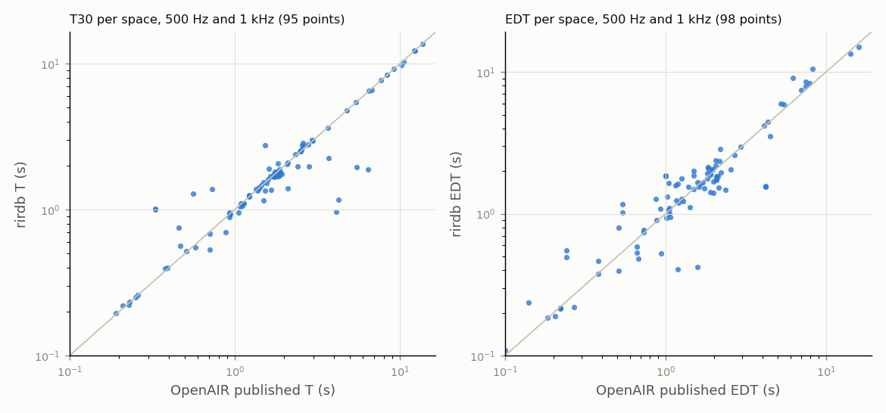

# Validation against published values

## OpenAIR data tables

49 spaces with a published table and analysed IRs. Ours: median over the space's preferred IRs of *valid* values (pyrato, Lundeby-compensated EDC). Published: the per-space table (method and IR selection not documented by OpenAIR, so perfect agreement is not expected; the 'Reverberation Time' row is compared with T30).

| metric | band | spaces | median ratio / diff | agreement |
|---|---|---|---|---|
| c80 | 125 | 49 | median diff -2.96 dB | MAE 5.13 dB |
| c80 | 250 | 49 | median diff -1.78 dB | MAE 3.31 dB |
| c80 | 500 | 49 | median diff -0.42 dB | MAE 2.78 dB |
| c80 | 1000 | 49 | median diff -0.29 dB | MAE 1.91 dB |
| c80 | 2000 | 49 | median diff -0.01 dB | MAE 2.07 dB |
| c80 | 4000 | 49 | median diff +0.11 dB | MAE 2.20 dB |
| d50 | 125 | 49 | median diff -0.21 | MAE 0.27 |
| d50 | 250 | 49 | median diff -0.05 | MAE 0.11 |
| d50 | 500 | 49 | median diff -0.02 | MAE 0.10 |
| d50 | 1000 | 49 | median diff -0.02 | MAE 0.08 |
| d50 | 2000 | 49 | median diff -0.00 | MAE 0.08 |
| d50 | 4000 | 49 | median diff +0.00 | MAE 0.08 |
| edt | 125 | 49 | 1.001 | 31 % |
| edt | 250 | 49 | 0.966 | 39 % |
| edt | 500 | 49 | 0.984 | 41 % |
| edt | 1000 | 49 | 1.027 | 41 % |
| edt | 2000 | 49 | 1.051 | 22 % |
| edt | 4000 | 49 | 0.987 | 35 % |
| t30 | 125 | 47 | 0.971 | 57 % |
| t30 | 250 | 49 | 0.998 | 69 % |
| t30 | 500 | 49 | 1.001 | 73 % |
| t30 | 1000 | 46 | 0.998 | 76 % |
| t30 | 2000 | 48 | 0.992 | 75 % |
| t30 | 4000 | 48 | 0.991 | 73 % |

